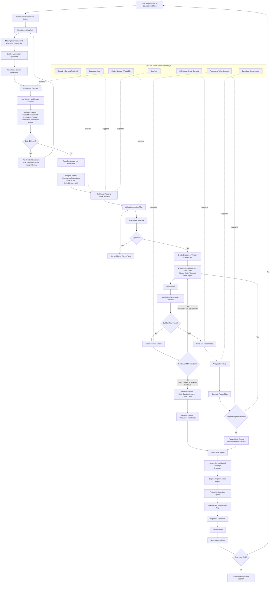

**Navigation:**

- [Overview](PRODUCT_VISION.md)
- [01 Principles](01_PRODUCT_PRINCIPLES.md)
- [02 Workflows](02_AI_MANAGED_WORKFLOW.md)
- [03 Orchestration](03_AI_ORCHESTRATION_AND_MULTI_ROLE_GOVERNANCE.md)
- [04 Tech stack & rules](04_TECH_STACK_AND_RULE_GENERATION.md)
- [05 Verification](05_VERIFICATION_AND_RISK.md)
- [06 Build & repair](06_BUILD_REPAIR_AND_STOP_CONDITIONS.md)
- [07 Engineering judgment](07_ENGINEERING_THINKING_AND_JUDGMENT.md)
- [08 Learning](08_LEARNING_REFLECTION_AND_SKILL_DEVELOPMENT.md)
- [09 Adapters](09_AGENT_ADAPTERS_AND_FRAMEWORK_FILES.md)
- [10 Platform](10_PRODUCTIZATION_AND_PLATFORM.md)
- [11 Research](11_RESEARCH_POSITIONING.md)
- [12 Chief](12_CHIEF_COMPARISON.md)
- [13 Examples](13_EXAMPLES_AND_SCENARIOS.md)
- [Glossary](14_GLOSSARY.md)

# AI-Managed Workflow (Full Product Mode)

This document describes **workflows** in **full product mode**: an AI-managed,
verification-governed path where the framework can coordinate setup, planning,
verification, repair, and learning artifacts. For a lighter integration where
the user drives an existing coding agent through project-local framework files,
see [Chief compatibility mode](12_CHIEF_COMPARISON.md).

Existing AI coding agents are **orchestrated and governed execution tools**:
they read framework instructions and perform implementation, but the framework
defines planning, verification, repair, stop behavior, and learning outputs.

---

## Existing project and development task workflow

The following is the **continuous loop for an existing repository or a scoped
development task** (distinct from
[AI-managed new project initialization](#ai-managed-new-project-initialization-workflow)
below).

> **Important distinction:** For existing projects, the tech stack is already
> known. The system detects the stack from the repository and generates
> task-scoped rules from that detected stack. The system does not re-select a
> new technology stack at each task. Tech stack review applies only when the
> task itself requires a stack-level change (for example, adding a new database,
> replacing a framework, or adding a major dependency).

### Core workflow

The system workflow is designed as a continuous development-and-learning loop.
One cycle starts from a user requirement or development task, produces verified
implementation artifacts, generates learning artifacts, and then feeds the next
task or learning path.

The system workflow is:

1. User provides project requirement or development task
2. Requirement analysis
3. Missing information and assumption detection
4. Acceptance Criteria Generation: define what must be true for the task to be
   considered complete
5. AI-assisted project planning
6. Architecture and impact analysis; tech stack review only if the task requires
   a stack-level change (for example, adding a major dependency, replacing a
   framework, or introducing a new database)
7. Impact analysis: identify affected files, modules, APIs, schema, tests, and
   risk areas
8. Verification Gate 1: Requirement, acceptance criteria, architecture, and
   impact review
9. Task breakdown into milestones and implementation steps
10. Cost and Token Optimization Layer: select task-relevant context, reuse
    cached summaries, compress error logs, apply model routing where
    appropriate, and enforce token/repair budgets before additional AI calls
11. AI implementation plan
12. Risk-Based Approval: classify the proposed change as Low, Medium, or High
    risk and require appropriate approval before code modification
13. Snapshot and Versioning: save the current project state or create a
    branch/worktree before AI edits code
14. AI-assisted implementation in a local workspace, branch, worktree, or
    sandbox
15. Diff Preview: show what files were created, modified, or deleted and why
16. Build-and-Repair Loop with Stop Conditions: run build/lint/typecheck/tests,
    observe errors, repair controlled issues, stop when required checks pass,
    and escalate when repair limits are reached or human review is required
17. Verification Gate 2: Code quality, security, build, test, and
    maintainability checks
18. Verification Gate 3: Production readiness check
19. Trust/Risk Report
20. Failure Mode Report if the task cannot be completed safely
21. Human Review Handoff Package if senior, security, or instructor review is
    required
22. Engineering Reflection Report: explain what the AI understood, what it
    changed, why it changed it, what trade-offs were involved, what verification
    evidence was produced, and what the user should learn
23. Project Decision Log update: record significant engineering decisions,
    alternatives, trade-offs, and unresolved risks
24. Repeated Reflection: ask the user to compare their own reasoning with the
    system's explanation and identify what they learned or misunderstood
25. Skill Progression Map update: map the task to software engineering skill
    areas and update the user's learning profile
26. Mentor Mode and Next Learning Path: guide the user toward the next task,
    next skill, or next review question
27. Continue to the next development task or end the current learning session

## AI-Managed New Project Initialization Workflow

For a new project, the framework should not generate detailed technical rules
before understanding the product idea and selecting an appropriate technology
stack. The initialization flow should separate trust-kernel installation from
project-specific rule generation.

A new-project flow may look like this:

1. User starts a new project and runs **`vgai init`** (optional agent slash
   alias: `/vgai-init`)
2. The system installs the trust kernel, AI role contracts, workflow templates,
   report templates, and deterministic scripts
3. AI performs product discovery using questions that less-experienced users can
   answer, such as user roles, business workflows, prototype vs production
   intent, data sensitivity, deployment expectations, and learning goals
4. AI Tech Stack Recommender proposes a technology stack based on product needs,
   verification capability, maintainability, learning difficulty, deployment
   assumptions, and available tooling
5. AI Critic challenges the selected stack by comparing alternatives and
   identifying risks such as setup complexity, production limitations, security
   concerns, or over-engineering
6. AI Security and Risk Reviewer checks whether the stack introduces
   authentication, authorization, data, secret, migration, or
   production-readiness concerns
7. AI Arbiter selects the final stack under a stated confidence level and writes
   a Tech Stack Decision Record
8. AI Rule Generator creates stack-aware project rules, workflow rules, security
   rules, testing rules, production-readiness rules, and learning rules
9. AI Rule Critic, Security Reviewer, and Rule Scenario Designer review and test
   the generated rules
10. AI Rule Arbiter compiles the rule registry into active rules, warning rules,
    guided-question rules, human-review triggers, rejected rules, and
    experimental rules
11. AI generates or updates `AGENTS.md`, `CLAUDE.md`, and other agent-specific
    instruction files from the approved rule registry
12. AI Safety Reviewer checks that these instruction files do not allow
    bypassing verification, uncontrolled repair, unsafe autonomy, or unsupported
    production/security claims
13. The existing coding agent or AI-managed builder begins implementation only
    after the governed project setup exists

If the user lacks technical knowledge, the system should not force the user to
choose a stack, database, framework, authentication method, or testing tool
directly. Instead, the system should choose a suitable default under autonomous
prototype mode, record the rationale, assumptions, alternatives considered,
risks, confidence level, and production-review limitations.

This workflow must not be interpreted as a one-way pipeline that ends after
Mentor Mode. Mentor Mode and Next Learning Path are the end of one development
session and the beginning of the next learning/development cycle.

## Workflow and sequence diagrams

This section provides visual representations of the framework-first workflow and
the interaction between the user, the framework, existing AI coding agents,
verification components, and learning artifacts.

The diagrams intentionally avoid treating the web app as the core system. The
web app may exist later as an interface layer, but the core workflow can run
through local project files, `AGENTS.md`, `CLAUDE.md`, scripts, CLI commands,
MCP tools, or other agent-compatible integration mechanisms.

## Overall Framework Workflow

