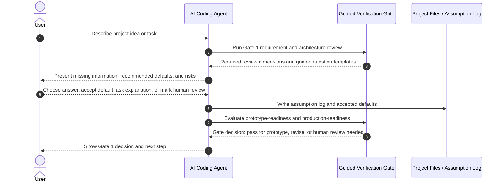

**Navigation:** [Overview](PRODUCT_VISION.md) ·
[01 Principles](01_PRODUCT_PRINCIPLES.md) ·
[02 Workflows](02_AI_MANAGED_WORKFLOW.md) ·
[03 Orchestration](03_AI_ORCHESTRATION_AND_MULTI_ROLE_GOVERNANCE.md) ·
[04 Tech stack & rules](04_TECH_STACK_AND_RULE_GENERATION.md) ·
[05 Verification](05_VERIFICATION_AND_RISK.md) ·
[06 Build & repair](06_BUILD_REPAIR_AND_STOP_CONDITIONS.md) ·
[07 Engineering judgment](07_ENGINEERING_THINKING_AND_JUDGMENT.md) ·
[08 Learning](08_LEARNING_REFLECTION_AND_SKILL_DEVELOPMENT.md) ·
[09 Adapters](09_AGENT_ADAPTERS_AND_FRAMEWORK_FILES.md) ·
[10 Platform](10_PRODUCTIZATION_AND_PLATFORM.md) ·
[11 Research](11_RESEARCH_POSITIONING.md) ·
[12 Chief](12_CHIEF_COMPARISON.md) ·
[13 Examples](13_EXAMPLES_AND_SCENARIOS.md) ·
[Glossary](14_GLOSSARY.md)

# Verification and Risk

This document groups **verification gates**, **pre-implementation quality hooks** (acceptance criteria, test-aware workflow, risk-based approval), **human review handoff**, the **main verification dimensions**, and the **role of RAG**. For implementation-time repair, budgets, and failure stopping, see [06 Build, Repair, and Stop Conditions](06_BUILD_REPAIR_AND_STOP_CONDITIONS.md).

---

## Verification Gates

The system must not allow AI output to be trusted blindly.

Each major stage should include a verification gate.

For less-experienced users, verification gates must not behave like senior-engineer exams. The user should not be asked to independently judge whether an architecture is correct, whether a security assumption is complete, or whether a role design is sufficient without support.

Therefore, the framework should use **Guided Verification Gates**:

- the AI/framework performs the first-pass review
- missing information is converted into guided questions
- difficult engineering decisions are presented with recommended prototype defaults
- trade-offs are explained in simple language
- the user may answer, accept a default, ask for an explanation, or mark the item for human review
- assumptions selected by the system are recorded in an Assumption Log
- gate results are classified as prototype-ready, not production-ready, or requires human review

Example:

```text
Instead of asking:
"Is this architecture suitable?"

The framework asks:
"For a prototype, Next.js + TypeScript + Prisma + SQLite is simple and fast to set up.
However, SQLite may not be suitable for production with many concurrent users.
Do you want to accept this prototype default, choose PostgreSQL, ask for explanation, or mark this for human review?"
```

This design allows the framework to support users who do not yet have senior-level judgment while still keeping assumptions, risks, and human review needs visible.


Verification Gate 1 checks:
- requirement completeness
- missing information
- architecture suitability
- security assumptions
- role and permission design
- sensitive data concerns

Verification Gate 2 checks:
- code quality
- maintainability
- authorization logic
- input validation
- error handling
- dependency risks
- build/test/lint results where possible
- whether the AI-generated implementation can pass build, typecheck, lint, and test checks where applicable
- whether repair attempts changed the correct files and did not introduce new high-risk issues
- whether additional repair is justified by evidence or should be stopped
- whether remaining findings are high-priority issues or only optional/low-severity improvements
- whether unresolved build or runtime errors should be escalated to human review

Verification Gate 3 checks:
- Docker/build readiness
- environment configuration
- CI/CD
- health check
- logging
- monitoring
- database migration
- backup strategy
- secret management
- production deployment assumptions
## Guided Verification Gate 1 Sequence Diagram


## Acceptance Criteria Generation

Before the AI writes or modifies code, the system should generate explicit acceptance criteria for the task. These criteria define what must be true for the task to be considered complete.

Example:

```text
Task:
Add admin-only appointment deletion.

Acceptance Criteria:
- Admin users can delete appointments.
- Normal users cannot delete appointments.
- Unauthenticated users receive 401 Unauthorized.
- Authenticated non-admin users receive 403 Forbidden.
- Deleted appointments no longer appear in the appointment list.
- At least one test or verification check covers unauthorized deletion.
```

Purpose:

- prevent AI from implementing vague or incomplete requirements
- create a basis for tests and verification
- help users learn how engineers define task completion before writing code
- reduce reliance on subjective statements such as "make it better" or "review again"

## Test-Aware Workflow

The system should encourage test-aware implementation. It does not need to enforce full test-driven development in the first prototype, but it should make the AI consider tests before and after implementation.

The test-aware workflow is:

1. Generate acceptance criteria
2. Generate a test plan or test checklist
3. Implement code
4. Run available tests
5. Add or recommend missing tests
6. Report behavior that is not covered by tests

Typical test categories:

- success case
- invalid input case
- unauthorized case
- forbidden role case
- not-found case
- edge case
- regression case

This helps address the limitation that code may build successfully while still violating business rules or security expectations.

## Risk-Based Approval

Not all AI-generated changes have the same risk. The system should classify proposed code changes by risk level before applying them.

Suggested risk levels:

- Low Risk: formatting, comments, simple text changes, non-functional UI copy
- Medium Risk: validation, refactoring, API response changes, non-critical business logic
- High Risk: authentication, authorization, database schema, migrations, deletion logic, payment, security-sensitive code, secret handling, production configuration

Suggested approval policy:

- Low Risk changes may be auto-applied in sandbox but still shown as a diff
- Medium Risk changes require user approval before application
- High Risk changes require explicit approval and should usually generate a human review suggestion

Purpose:

- reduce the risk of AI modifying sensitive code without user awareness
- teach users that different engineering changes require different levels of review
- connect implementation decisions with risk-based software engineering judgment
## Human Review Handoff Package

When the system detects high-risk decisions, unresolved issues, or production-sensitive concerns, it should generate a Human Review Handoff Package. This package helps less-experienced developers ask better questions to a senior engineer, instructor, or security reviewer.

Suggested structure:

```markdown
# Human Review Handoff

## Task
Add admin-only appointment deletion.

## AI Changes
- Added requireAdmin middleware
- Modified DELETE appointment API
- Added basic authorization check

## Verification Evidence
- Build passed
- Typecheck passed
- Basic authorization check found

## Remaining Risks
- Permission matrix incomplete
- No audit logging for delete operation
- Session expiration policy unclear

## Questions for Reviewer
1. Is this RBAC model appropriate for the project?
2. Should deletion require audit logging?
3. Is the session handling secure enough?
4. Is this acceptable for production or only for prototype use?
```

Purpose:

- help junior developers know what to ask during human review
- make escalation structured instead of vague
- preserve the safe claim that the system does not replace senior engineers
## Main Verification Dimensions

The system evaluates AI-generated outputs in three dimensions:

1. Security
   - authentication
   - authorization / RBAC
   - input validation
   - secret management
   - audit logging
   - rate limiting
   - data protection
   - error handling

2. Code Quality / Maintainability
   - modularity
   - separation of concerns
   - error handling
   - testability
   - naming and structure
   - maintainability
   - duplication risk

3. Production Readiness
   - Dockerfile
   - environment variables
   - CI/CD
   - health check
   - logging
   - monitoring
   - database migration
   - backup strategy
   - deployment assumptions

In addition to these three main dimensions, the system also includes an implementation execution mechanism through the Build-and-Repair Loop with Stop Conditions. This mechanism checks whether AI-generated code can build, typecheck, lint, and pass tests where possible before the user is asked to trust the implementation. It also prevents unnecessary AI-driven changes by stopping repair when required checks pass and remaining findings are only low-severity or optional.

The system also includes a cost and token optimization mechanism to keep the agent's context and model usage efficient. This mechanism does not change the verification dimensions, but it helps the system choose relevant files, summarize logs, reuse cached context, and avoid unnecessary AI calls during implementation and repair.

The system also includes **Learning, reflection, and skill development mechanisms** ([08 Learning, Reflection, and Skill Development](08_LEARNING_REFLECTION_AND_SKILL_DEVELOPMENT.md)) and **engineering thinking and judgment scaffolding** ([07 Engineering Thinking and Judgment](07_ENGINEERING_THINKING_AND_JUDGMENT.md)). Those mechanisms do not replace verification, but transform verification evidence, implementation decisions, repair history, stop decisions, and remaining risks into artifacts and prompts that help users develop software engineering judgment over time.

## Role of RAG

RAG is only a supporting component.

RAG may be used to retrieve relevant checklists, guidelines, security rules, code quality principles, and production readiness criteria. However, the main research contribution is not RAG.

The main contribution is the structured AI-assisted development workflow with verification gates, trust/risk reporting, controlled implementation support, engineering reflection, skill progression tracking, and learning feedback.
