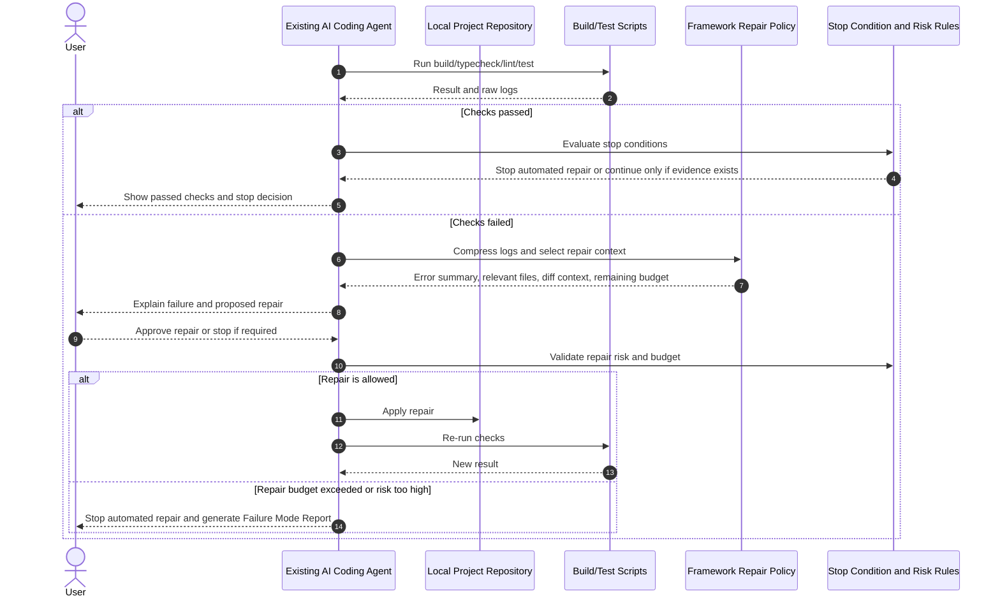

**Navigation:** [Overview](PRODUCT_VISION.md) ·
[01 Principles](01_PRODUCT_PRINCIPLES.md) ·
[02 Workflows](02_AI_MANAGED_WORKFLOW.md) ·
[03 Orchestration](03_AI_ORCHESTRATION_AND_MULTI_ROLE_GOVERNANCE.md) ·
[04 Tech stack & rules](04_TECH_STACK_AND_RULE_GENERATION.md) ·
[05 Verification](05_VERIFICATION_AND_RISK.md) ·
[06 Build & repair](06_BUILD_REPAIR_AND_STOP_CONDITIONS.md) ·
[07 Engineering judgment](07_ENGINEERING_THINKING_AND_JUDGMENT.md) ·
[08 Learning](08_LEARNING_REFLECTION_AND_SKILL_DEVELOPMENT.md) ·
[09 Adapters](09_AGENT_ADAPTERS_AND_FRAMEWORK_FILES.md) ·
[10 Platform](10_PRODUCTIZATION_AND_PLATFORM.md) ·
[11 Research](11_RESEARCH_POSITIONING.md) ·
[12 Chief](12_CHIEF_COMPARISON.md) ·
[13 Examples](13_EXAMPLES_AND_SCENARIOS.md) ·
[Glossary](14_GLOSSARY.md)

# Build, Repair, Stop Conditions, and Related Execution Controls

This document combines the **Build-and-Repair Loop** and **Stop Conditions**, the **Cost and Token Optimization Layer** (paired with repair/token budgets), **versioning / diff / rollback** controls, and the **Failure Mode Report** template. Verification gate definitions live in [05 Verification and Risk](05_VERIFICATION_AND_RISK.md).

---

## Build-and-Repair Loop with Stop Conditions

The Build-and-Repair Loop is a controlled mechanism inside the AI-assisted implementation stage. Its purpose is to address a common problem in AI-generated code: the implementation may look plausible but fail to build, run, typecheck, or pass tests in the actual project context.

The loop ensures that the system does not simply generate code and ask the user to trust it. Instead, the system attempts to verify whether the generated implementation works in a sandbox workspace before presenting the result as reliable.

The Build-and-Repair Loop follows this process:

1. The AI agent generates or modifies code for an approved task.
2. The system runs automated checks in a sandbox workspace where possible.
3. The system captures build, lint, typecheck, test, or runtime error logs.
4. The AI agent analyzes the error logs and proposes a repair plan.
5. The system allows the agent to apply controlled fixes to the relevant files.
6. The system reruns the checks.
7. The loop repeats until the checks pass or until the maximum repair attempt limit is reached.
8. If the issue cannot be resolved within the allowed attempts, the system marks the result as Requires Human Review and includes the unresolved error in the final report.

Example checks may include:

- package installation check
- lint check
- TypeScript typecheck
- unit test or integration test execution
- build check
- dependency audit where appropriate

The system should not allow unlimited repair attempts. A safe prototype may limit repair attempts to a small number, such as two or three iterations per task. This prevents the agent from repeatedly changing the project in uncontrolled ways.

The loop must also define explicit Stop Conditions to prevent over-repair. The agent should not continue modifying code only because it can still suggest improvements. Further repair should require evidence, such as a failed build, failed typecheck, failed test, unmet requirement, high-risk security finding, or unresolved verification gate failure.

Possible Stop Conditions include:

- build passes
- typecheck passes
- lint has no blocking errors
- tests pass where available
- required task acceptance criteria are satisfied
- no Critical or High severity findings remain
- remaining findings are Low, Informational, or optional refactoring suggestions
- the maximum repair attempt limit has been reached
- further repair may introduce regression or exceed the approved task scope

When Stop Conditions are met, the system should explicitly report a stop decision, such as:

```text
Decision: Stop Automated Repair
Reason:
- Build, typecheck, and tests passed
- No Critical or High severity issues remain
- Remaining findings are optional maintainability suggestions
Recommendation:
- Do not continue AI-driven modification automatically
- Human review may be requested only for optional improvement or final approval
```

The system should also classify review findings by severity before deciding whether to repair:

- Critical: must be repaired or escalated before passing the gate
- High: should be repaired or escalated before passing the gate
- Medium: may be repaired with user approval if within scope
- Low: should be reported but not automatically repaired
- Informational: should be reported only

This evidence-based stopping mechanism is important for less-experienced developers because they may repeatedly ask AI to review or improve code without knowing when the code is already good enough for the current scope. The system should help users avoid unnecessary changes, over-refactoring, and regression.

The Build-and-Repair Loop should produce evidence such as:

- commands executed
- pass/fail status
- error summaries
- files modified during repair
- number of repair attempts
- unresolved issues
- whether human review is required

This loop is not intended to guarantee that the software is correct, secure, or production-ready. It only provides a stronger implementation-level verification step before the user trusts AI-generated code.

In short:

AI should not only write code. The system should run the code, observe failures, attempt controlled repair, stop when evidence shows the code is good enough for the current scope, and report remaining risks.

## Cost and Token Optimization Layer

The Cost and Token Optimization Layer is a supporting system-design component for the AI coding agent workflow. Its purpose is to reduce unnecessary token usage, cost, latency, and context noise while preserving the quality of implementation, repair, verification, and reporting.

This layer is important because a coding-agent-style system may require multiple LLM calls across requirement analysis, codebase understanding, implementation planning, code modification, build/test repair, security review, production readiness review, and trust/risk reporting. Without cost and token control, the system may become expensive, slow, and less reliable because the model receives too much irrelevant context.

The system should not blindly send the entire repository, full build logs, or every file to the LLM. Instead, it should use cost-aware context management.

The Cost and Token Optimization Layer may include the following strategies:

1. **Selective Context Retrieval**
   - Select only task-relevant files or snippets instead of sending the full repository.
   - Use the user task, file tree, imports/exports, framework conventions, and keyword or embedding-based search to identify relevant files.
   - Expand context only when the agent needs additional evidence.

2. **Codebase Map**
   - Generate a compact project summary after repository upload.
   - Include framework, language, main routes, database schema, authentication status, important folders, and key files.
   - Reuse this map across planning, implementation, and verification steps instead of repeatedly summarizing the full project.

3. **Multi-Level Context**
   - Use different levels of context depending on the task:
     - project summary for high-level planning
     - file map for locating relevant code
     - snippets for local reasoning
     - full files only when editing is required
   - Start with cheaper context and expand only when necessary.

4. **Diff-Based Repair Context**
   - During repair, avoid resending the entire project.
   - Send the relevant original file, the latest diff, the failed command, the compressed error summary, and the previous repair summary.
   - This helps the agent focus on what changed and why the current failure occurred.

5. **Error Log Compression**
   - Build, typecheck, lint, and test logs may be long.
   - The system should extract the primary error, affected file and line, likely cause, related files, and failed command before sending the error to the LLM.
   - Full logs can be stored for traceability but should not always be included in the prompt.

6. **Caching**
   - Cache codebase maps, file summaries, dependency summaries, route summaries, schema summaries, previous verification results, and build-log summaries.
   - Reuse cached artifacts when the relevant files have not changed.
   - Invalidate or refresh cached summaries when related files are modified by the agent.

7. **Model Routing**
   - Use smaller or cheaper models for simpler tasks such as file classification, summary formatting, or report formatting.
   - Use stronger models for higher-risk reasoning such as implementation planning, security review, repair planning, and stop-condition decisions.
   - The goal is not to always use the largest model, but to match model capability to task risk.

8. **Repair and Token Budgets**
   - Limit repair attempts per task.
   - Track total LLM calls, prompt tokens, completion tokens, and estimated cost per task.
   - Stop additional AI calls when the repair budget or token budget is exceeded, then produce a human review report.
   - Combine token budgets with Stop Conditions to avoid endless review or refactoring cycles.

9. **Evidence-Based AI Calls**
   - Use deterministic tools whenever possible for file listing, package parsing, build execution, lint execution, typecheck execution, test execution, and diff generation.
   - Call the LLM only when reasoning, planning, explanation, repair, or risk classification is needed.

The layer should produce cost and token evidence such as:

- number of LLM calls per task
- estimated token usage per task
- estimated cost per task
- files selected as context
- files excluded from context
- cache hits and cache misses
- compressed error-log summaries
- repair attempts used
- whether token or repair budget limits were reached

This layer does not replace the verification gates. It supports them by making the agent more efficient, focused, and less likely to make unnecessary or context-noisy changes.

In short:

The system should not only verify AI-generated code. It should also control how much context, cost, and model reasoning are used to produce, repair, and verify that code.

## Build-and-Repair Loop Sequence Diagram



## Versioning, Diff Preview, and Rollback

The system should never treat AI code changes as final without review. Before AI modifies code, the system should create a project snapshot or version checkpoint.

Required behavior:

1. Create a snapshot before AI edits files
2. Apply AI changes in a sandbox workspace
3. Generate a diff preview
4. Show changed files and rationale
5. Allow Accept, Reject, or Rollback
6. Export the patch if needed

Example output:

```text
Changed files:
- prisma/schema.prisma
- src/lib/require-admin.ts
- src/app/api/appointments/[id]/route.ts

Decision options:
- Accept changes
- Reject changes
- Roll back to previous snapshot
- Export patch for manual review
```

Purpose:

- prevent AI changes from damaging the user's original project
- make the system safer for less-experienced developers
- provide a concrete artifact for learning and human review

## Failure Mode Report

When AI cannot safely complete or repair a task, the system should generate a Failure Mode Report instead of continuing to modify code indefinitely.

Suggested structure:

```markdown
# Failure Mode Report

## Status

Requires Human Review

## What Failed

Build still fails after 3 repair attempts.

## What Was Attempted

- Added role field to User model
- Updated authorization helper
- Updated appointment delete route

## Current Error

SessionUser type does not include role information.

## Likely Root Cause

The existing session structure conflicts with the newly added RBAC logic.

## Why Automated Repair Stopped

Repair budget was exceeded and further changes may affect authentication behavior.

## Recommended Next Step

Ask a senior developer to review session handling and authorization design.
```

Purpose:

- convert failure into an understandable learning artifact
- prevent endless AI repair loops
- clearly communicate what humans should inspect next
