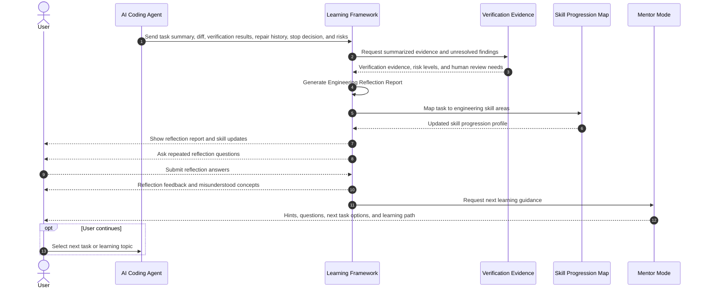

**Navigation:** [Overview](PRODUCT_VISION.md) ·
[01 Principles](01_PRODUCT_PRINCIPLES.md) ·
[02 Workflows](02_AI_MANAGED_WORKFLOW.md) ·
[03 Orchestration](03_AI_ORCHESTRATION_AND_MULTI_ROLE_GOVERNANCE.md) ·
[04 Tech stack & rules](04_TECH_STACK_AND_RULE_GENERATION.md) ·
[05 Verification](05_VERIFICATION_AND_RISK.md) ·
[06 Build & repair](06_BUILD_REPAIR_AND_STOP_CONDITIONS.md) ·
[07 Engineering judgment](07_ENGINEERING_THINKING_AND_JUDGMENT.md) ·
[08 Learning](08_LEARNING_REFLECTION_AND_SKILL_DEVELOPMENT.md) ·
[09 Adapters](09_AGENT_ADAPTERS_AND_FRAMEWORK_FILES.md) ·
[10 Platform](10_PRODUCTIZATION_AND_PLATFORM.md) ·
[11 Research](11_RESEARCH_POSITIONING.md) ·
[12 Chief](12_CHIEF_COMPARISON.md) ·
[13 Examples](13_EXAMPLES_AND_SCENARIOS.md) ·
[Glossary](14_GLOSSARY.md)

# Learning, Reflection, and Skill Development

This document is the primary home for **learning and reflection mechanics** under the AI-managed, verification-governed model: structured artifacts (**Engineering Reflection Report**, **reflection question sets**, **project decision log** patterns, **rubric-based scoring**), **skill progression**, **mentor mode**, **repeated reflection**, **post-task learning** flows, and the **engineering learning sequence diagram**.

For the **thinking and judgment capabilities** those artifacts are meant to strengthen—critical thinking, problem framing, assumption management, trade-offs, risk, verification, security, system impact, stop/continue and human-review judgment, and calibrated AI skepticism—see [07 Engineering Thinking and Judgment](07_ENGINEERING_THINKING_AND_JUDGMENT.md).

---

## Engineering Reflection Report

After each major task or development session, the system should generate an Engineering Reflection Report. This report is a structured learning document that the user can revisit later to understand how the task was approached and what engineering lessons were involved.

The report may include:

1. **Task Summary**
   - What the user asked the agent to do
   - The final status of the task
   - Whether the task is prototype-ready, blocked, or requires human review

2. **Project Context Understanding**
   - What the agent understood about the project structure
   - Framework, language, database, authentication status, important routes, and relevant files
   - Assumptions made by the agent

3. **Requirement and Assumption Analysis**
   - Functional requirements inferred from the task
   - Non-functional requirements such as security, maintainability, and production readiness
   - Missing or ambiguous requirements
   - Assumptions that should be confirmed by the user or a human reviewer

4. **Implementation Plan**
   - The planned implementation steps
   - Files or modules expected to change
   - Acceptance criteria for the task

5. **Files Changed and Rationale**
   - Which files were created or modified
   - Why each file was changed
   - How each change relates to the requirement or verification gate

6. **Alternatives Considered**
   - Alternative designs or implementation approaches
   - Why the selected approach was chosen
   - Why some alternatives were not chosen

7. **Engineering Trade-offs**
   - Benefits and drawbacks of the chosen approach
   - Impact on maintainability, complexity, scalability, security, and delivery speed

8. **Build-and-Repair History**
   - Commands executed
   - Errors encountered
   - Repair attempts made
   - Whether the repair succeeded or required human review

9. **Verification Evidence**
   - Build, typecheck, lint, and test results where available
   - Security, code quality, and production readiness findings
   - Evidence used to classify findings

10. **Security and Privacy Review**
    - Authentication and authorization concerns
    - Sensitive data concerns
    - Input validation, secret management, audit logging, and rate limiting concerns

11. **Maintainability Review**
    - Modularity, duplication, naming, separation of concerns, testability, and long-term readability

12. **Production Readiness Review**
    - Environment configuration, deployment assumptions, logging, monitoring, migration, backup, health checks, and rollback concerns

13. **Test Coverage Review**
    - What behavior is tested
    - What important behavior is not tested
    - Whether negative cases, unauthorized cases, and edge cases are covered

14. **Stop / Continue / Human Review Decision**
    - Whether the AI should stop modifying the code
    - Whether further repair is justified
    - Whether the remaining issues should be split into a new task
    - Whether senior, security, or production review is required

15. **Debugging and Observability Notes**
    - If this feature fails in production, what logs, metrics, traces, or error information would help debug it
    - Whether the current implementation provides enough observability

16. **Key Lessons Learned**
    - What the user should learn from this task
    - What engineering principle was demonstrated
    - Common mistakes the user should avoid

17. **Suggested Learning Path**
    - Topics the user should study next
    - Priority level for each topic
    - Connection between the task and broader software engineering skills

## Engineering Reflection Questions

The system should guide users with recurring reflection questions. These questions should help users move from task-level coding toward system-level engineering judgment.

Core questions include:

1. Did the AI understand the real problem and project context correctly?
2. What requirements, assumptions, or missing information influenced the implementation?
3. What parts of the system were changed, and why?
4. What alternative approaches were available, and why was this approach selected?
5. What trade-offs were made in terms of complexity, maintainability, security, scalability, and delivery speed?
6. What evidence shows that the implementation works at a basic level?
7. What security or privacy risks remain?
8. Will this code be maintainable by another developer in the future?
9. Is the implementation production-ready, prototype-ready, or still incomplete?
10. Are the tests sufficient to protect important behavior?
11. Should the AI continue modifying the code, stop, or escalate to human review?
12. If this feature fails in production, how would the team detect, debug, and recover from it?
13. What should the user learn next to improve their software engineering judgment?

These questions are intended to train the user to think beyond whether the code merely runs. A junior developer may ask, "Does the code work?" A senior engineer also asks, "Is this appropriate for the system, risk level, team, and future maintenance of the project?"

## Project Decision Log

The system should maintain a decision log for significant engineering decisions. This helps the user learn not only what code changed, but why a certain design direction was chosen.

Suggested structure:

```markdown
# Project Decision Log

## Decision 001: Use role-based access control

Reason:
The system has different user types and privileged operations.

Alternative Considered:
Hardcode admin email checks inside each route.

Why Not Chosen:
Hardcoding admin checks increases maintenance risk and is less scalable.

Trade-off:
Centralized RBAC improves maintainability but requires careful testing because shared authorization logic becomes critical.
```

Purpose:

- teach architecture and design decision making
- preserve reasoning across multiple AI-assisted sessions
- help the user develop senior-like engineering memory for the project

## Rubric-Based Scoring

The system may optionally provide heuristic scores to help users prioritize issues. These scores should never be presented as certification or proof that the software is secure or production-ready.

Possible scoring areas:

- Requirement Completeness: 0-5
- Architecture Suitability: 0-5
- Code Quality: 0-5
- Security Readiness: 0-5
- Test Coverage: 0-5
- Production Readiness: 0-5
- Learning Value: 0-5

Important limitation:

The score is a heuristic assessment for prioritization and learning. It is not a guarantee of correctness, security, or production readiness.

---

## Skill Progression Map

The Skill Progression Map is a learning profile that tracks which software engineering skill areas the user has practiced through AI-assisted tasks.

The map should not be treated as a certification of seniority. Instead, it is a reflective progress tool that helps the user see which areas they have been exposed to and which areas need more practice.

Possible skill areas include:

1. Requirement Analysis
   - identifying user roles
   - detecting missing requirements
   - separating functional and non-functional requirements
   - identifying assumptions

2. Architecture and System Design
   - selecting appropriate architecture
   - understanding trade-offs
   - identifying coupling and boundaries
   - reasoning about scalability and complexity

3. Secure Software Development
   - authentication
   - authorization and RBAC
   - input validation
   - secret management
   - audit logging
   - rate limiting
   - data protection

4. Code Quality and Maintainability
   - modularity
   - naming
   - separation of concerns
   - duplication reduction
   - testability
   - readability

5. Testing Strategy
   - unit testing
   - integration testing
   - negative cases
   - edge cases
   - regression protection

6. Build and Debugging
   - reading build errors
   - typecheck failures
   - dependency issues
   - repair planning
   - regression detection

7. Production Readiness
   - environment configuration
   - Docker/build readiness
   - CI/CD
   - health checks
   - logging
   - monitoring
   - migrations
   - backup and rollback planning

8. Risk-Based Decision Making
   - classifying findings by severity
   - deciding when to repair, stop, or escalate
   - understanding acceptable risk for prototype vs production

9. Observability and Operations
   - logs
   - metrics
   - tracing
   - error reporting
   - incident debugging

10. Human Review and Collaboration
    - knowing when to ask for senior review
    - preparing review questions
    - explaining trade-offs to others
    - documenting decisions

The Skill Progression Map may show evidence such as:

- tasks completed in each skill area
- learning reports generated
- reflection questions answered
- verification findings reviewed
- human review items identified
- repeated mistakes or recurring gaps
- suggested next learning topics

Example output:

```text
Skill Progression Map
Requirement Analysis:       Practiced 4 tasks / Needs deeper stakeholder validation
Security Awareness:         Practiced 3 tasks / Needs more authorization and audit logging practice
Testing Strategy:           Practiced 2 tasks / Needs negative-case and integration testing practice
Production Readiness:       Practiced 1 task  / Needs logging, monitoring, migration, and backup practice
Risk-Based Decision Making: Practiced 3 tasks / Improving stop vs repair decisions
```

## Repeated Reflection Workflow

Repeated Reflection is a workflow that asks users to think before and after receiving AI feedback. This is important because users learn more when they actively compare their own reasoning with the system's reasoning instead of only reading AI-generated explanations.

The workflow may include:

1. **Pre-Reflection**
   - Before the AI reveals its full analysis, the system asks the user what they think.
   - Example questions:
     - What files do you think need to change?
     - What risks do you expect?
     - What tests should be added?
     - When should the AI stop modifying the code?

2. **AI Analysis and Implementation**
   - The AI performs codebase analysis, planning, implementation, verification, repair, and reporting.

3. **Post-Reflection**
   - After the report is generated, the system asks the user to compare their initial reasoning with the AI's findings.
   - Example questions:
     - What did you miss?
     - What did the AI miss?
     - Which trade-off do you now understand better?
     - Do you agree with the stop or human review decision?

4. **Learning Summary**
   - The system summarizes the user's learning gaps, improvements, and next topics.

5. **Skill Map Update**
   - The system updates the Skill Progression Map based on the task and reflection evidence.

Repeated Reflection helps the system act less like a code generator and more like a guided learning environment.

## Mentor Mode

Mentor Mode is an interaction style where the system guides the user toward understanding instead of always giving immediate final answers.

Mentor Mode may include:

1. **Socratic Questions**
   - The system asks guiding questions before revealing the answer.
   - Example: "Before adding admin-only deletion, where should authorization be enforced: UI, API, or both? Why?"

2. **Hints Before Solutions**
   - The system provides hints in increasing detail.
   - Example:
     - Hint 1: Think about whether hiding a button in the UI is enough.
     - Hint 2: Users can call APIs directly.
     - Hint 3: Authorization should be enforced on the server/API side.

3. **Progressive Disclosure**
   - The system first explains the concept simply, then provides deeper technical detail when the user requests it.

4. **Explain-Then-Ask Mode**
   - The system explains a concept and then asks the user to apply it to the current project.

5. **Challenge Mode**
   - The system asks the user to identify risks, tests, or trade-offs before showing the system's answer.

6. **Review Simulation**
   - The system simulates questions a senior engineer might ask during code review.
   - Example:
     - Why did you choose this architecture?
     - What happens if this API is called by a non-admin user?
     - How would you debug this if it fails in production?
     - What is the rollback plan if the migration fails?

7. **Answer Comparison**
   - The system compares the user's answer with the AI's answer and highlights differences.

Mentor Mode should be optional because some users may want fast implementation, while others may want deeper learning. The system may support modes such as:

- Fast Mode: prioritize implementation and verification
- Guided Mode: include short reflection questions and explanations
- Mentor Mode: include deeper reasoning, questions, hints, and learning exercises

## Post-Task Learning Workflow

A complete learning-oriented workflow may look like this:

1. User provides a development task
2. System asks short pre-reflection questions
3. User answers what they think should happen
4. AI analyzes project context and requirements
5. AI proposes an implementation plan
6. User approves or revises the plan
7. AI implements the task in a sandbox workspace
8. Cost and Token Optimization Layer controls context and model usage
9. Build-and-Repair Loop verifies and repairs the implementation where possible
10. Stop Conditions decide whether AI should continue or stop
11. Verification Gates evaluate security, code quality, and production readiness
12. Final Trust/Risk Report is generated
13. Engineering Reflection Report is generated
14. User answers post-reflection questions
15. Skill Progression Map is updated
16. Suggested learning path and human review checklist are produced

This workflow helps users learn not only what changed, but why it changed, what risks remain, and what engineering skill they should develop next.

## Engineering Learning Sequence Diagram


