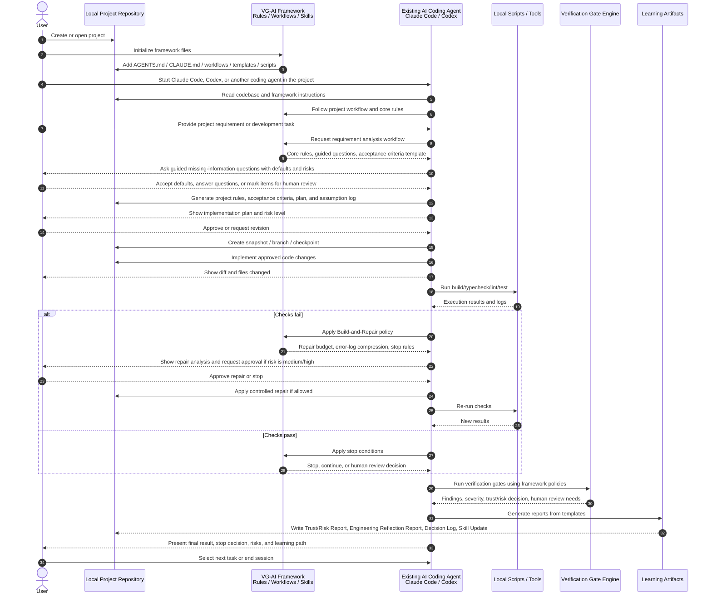

**Navigation:**

- [Overview](PRODUCT_VISION.md)
- [01 Principles](01_PRODUCT_PRINCIPLES.md)
- [02 Workflows](02_AI_MANAGED_WORKFLOW.md)
- [03 Orchestration](03_AI_ORCHESTRATION_AND_MULTI_ROLE_GOVERNANCE.md)
- [04 Tech stack & rules](04_TECH_STACK_AND_RULE_GENERATION.md)
- [05 Verification](05_VERIFICATION_AND_RISK.md)
- [06 Build & repair](06_BUILD_REPAIR_AND_STOP_CONDITIONS.md)
- [07 Engineering judgment](07_ENGINEERING_THINKING_AND_JUDGMENT.md)
- [08 Learning](08_LEARNING_REFLECTION_AND_SKILL_DEVELOPMENT.md)
- [09 Adapters](09_AGENT_ADAPTERS_AND_FRAMEWORK_FILES.md)
- [10 Platform](10_PRODUCTIZATION_AND_PLATFORM.md)
- [11 Research](11_RESEARCH_POSITIONING.md)
- [12 Chief](12_CHIEF_COMPARISON.md)
- [13 Examples](13_EXAMPLES_AND_SCENARIOS.md)
- [Glossary](14_GLOSSARY.md)

# Chief Comparison and Compatibility Mode

**Chief compatibility mode** is a supported way to run the framework:
project-local instructions (`AGENTS.md`, `CLAUDE.md`, workflows, skills) guide
**existing** AI coding agents. **Full product mode** adds AI-managed setup,
multi-role governance, and deeper orchestration (see
[02](02_AI_MANAGED_WORKFLOW.md),
[03](03_AI_ORCHESTRATION_AND_MULTI_ROLE_GOVERNANCE.md)).

---

## Relationship to Chief

Chief is a structured workflow framework for AI coding agents. It is useful for
engineers who already know how to supervise AI agents effectively.

My project is inspired by the structured workflow idea, but targets
less-experienced developers who do not yet have enough senior-level judgment.
Therefore, my system adds verification gates, guided verification questions,
trust reports, risk detection, checklist-based review, Build-and-Repair Loops,
Stop Conditions, Engineering Reflection Reports, Skill Progression, Mentor Mode,
and human review handoff materials to help users decide whether AI-generated
outputs should be trusted, revised, stopped, or escalated to human review.

In short:

> Chief helps experienced engineers control AI agents. My project helps
> less-experienced developers use AI coding agents through verification, guided
> decision-making, and learning support.

The framework can operate in a Chief-like way. It may use files such as
`AGENTS.md`, `CLAUDE.md`, workflow documents, skill files, report templates, and
scripts so that existing tools such as Claude Code or Codex can follow the
framework without requiring a new AI coding agent or full web app.

The key difference is the target user and the added learning/verification layer:

- Chief-style workflow: structure and control for experienced AI-agent users
- This framework: structure, verification, stop decisions, risk reporting, and
  engineering learning support for less-experienced developers

## Chief Compatibility Mode: Framework Usage Sequence Diagram

