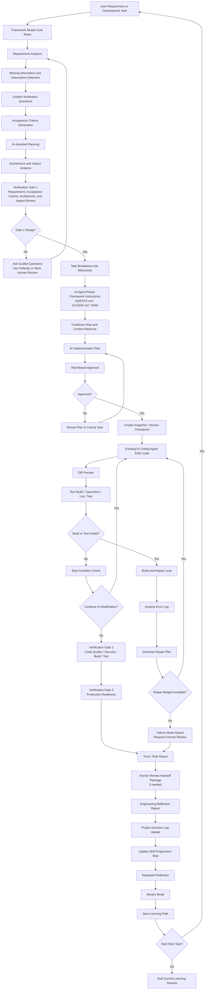

**การนำทาง:** ดู [ภาพรวม](PRODUCT_VISION.md)

# เวิร์กโฟลว์ที่ AI จัดการ (Full Product Mode)

เอกสารนี้อธิบาย **เวิร์กโฟลว์** ใน **full product mode**: เส้นทางที่ AI จัดการและถูกกำกับด้วย verification ซึ่ง framework สามารถประสานการตั้งค่า การวางแผน การตรวจสอบ การซ่อมแซม และ learning artifacts ได้ หากต้องการ integration ที่เบากว่า ซึ่งผู้ใช้ขับเคลื่อน coding agent เดิมผ่านไฟล์ framework ภายในโปรเจกต์ ดู [Chief compatibility mode](12_CHIEF_COMPARISON.md)

AI coding agents ที่มีอยู่แล้วเป็น **เครื่องมือดำเนินงานที่ถูกประสานและกำกับ**: มันอ่าน framework instructions และ implement แต่ framework เป็นผู้กำหนด planning, verification, repair, stop behavior และ learning outputs

---

## เวิร์กโฟลว์สำหรับโปรเจกต์เดิมและงานพัฒนา

ส่วนนี้คือ **continuous loop สำหรับ repository เดิมหรืองานพัฒนาเฉพาะขอบเขต** ซึ่งแยกจาก [การเริ่มโปรเจกต์ใหม่ที่ AI จัดการ](#ai-managed-new-project-initialization-workflow)

> **จุดแยกสำคัญ:** สำหรับโปรเจกต์เดิม tech stack เป็นสิ่งที่รู้แล้ว ระบบตรวจ stack จาก repository และสร้าง task-scoped rules จาก stack ที่ตรวจพบ ระบบไม่เลือก technology stack ใหม่ในทุกงาน Tech stack review ใช้เฉพาะเมื่อ task ต้องเปลี่ยนระดับ stack เช่น เพิ่ม database ใหม่ เปลี่ยน framework หรือเพิ่ม dependency ใหญ่

### Core workflow

หนึ่งรอบของระบบเริ่มจาก requirement หรืองานพัฒนาของผู้ใช้ สร้าง implementation artifacts ที่ตรวจสอบแล้ว สร้าง learning artifacts แล้วป้อนกลับไปสู่งานหรือเส้นทางเรียนรู้ถัดไป

เวิร์กโฟลว์คือ:

1. ผู้ใช้ให้ project requirement หรือ development task
2. วิเคราะห์ requirement
3. ตรวจจับข้อมูลที่ขาดและ assumptions
4. สร้าง Acceptance Criteria เพื่อกำหนดสิ่งที่ต้องเป็นจริงจึงถือว่างานเสร็จ
5. วางแผนโปรเจกต์ด้วย AI
6. วิเคราะห์ architecture และ impact; รีวิว tech stack เฉพาะเมื่อ task ต้องเปลี่ยนระดับ stack
7. วิเคราะห์ impact: ระบุ files, modules, APIs, schema, tests และ risk areas ที่ได้รับผล
8. Verification Gate 1: รีวิว requirement, acceptance criteria, architecture และ impact
9. แตกงานเป็น milestones และ implementation steps
10. Cost and Token Optimization Layer: เลือก context ที่เกี่ยวกับ task, ใช้ cached summaries, compress error logs, route model เมื่อเหมาะสม และบังคับ token/repair budgets ก่อน calls เพิ่มเติม
11. AI implementation plan
12. Risk-Based Approval: จัดระดับความเสี่ยง Low, Medium หรือ High และขอ approval ที่เหมาะสมก่อนแก้ code
13. Snapshot and Versioning: เก็บ state ปัจจุบันหรือสร้าง branch/worktree ก่อน AI edit
14. AI-assisted implementation ใน local workspace, branch, worktree หรือ sandbox
15. Diff Preview: แสดงไฟล์ที่สร้าง แก้ หรือลบ และเหตุผล
16. Build-and-Repair Loop with Stop Conditions: รัน build/lint/typecheck/tests, ดู errors, ซ่อม issue ที่ควบคุมได้, หยุดเมื่อ checks ที่จำเป็นผ่าน และ escalate เมื่อ repair limit ถึงหรือจำเป็นต้อง human review
17. Verification Gate 2: ตรวจ code quality, security, build, test และ maintainability
18. Verification Gate 3: ตรวจ production readiness
19. Trust/Risk Report
20. Failure Mode Report ถ้างานไม่สามารถทำให้เสร็จอย่างปลอดภัย
21. Human Review Handoff Package ถ้าต้องให้ senior, security หรือ instructor review
22. Engineering Reflection Report: อธิบายว่า AI เข้าใจอะไร เปลี่ยนอะไร ทำไมเปลี่ยน trade-offs อะไร evidence อะไรถูกสร้าง และผู้ใช้ควรเรียนรู้อะไร
23. อัปเดต Project Decision Log: บันทึก decisions สำคัญ alternatives trade-offs และ unresolved risks
24. Repeated Reflection: ให้ผู้ใช้เทียบ reasoning ของตัวเองกับคำอธิบายของระบบและระบุสิ่งที่เรียนรู้หรือเข้าใจผิด
25. อัปเดต Skill Progression Map: map task กับ skill areas ด้าน software engineering และอัปเดต learning profile
26. Mentor Mode และ Next Learning Path: guide ผู้ใช้สู่งานถัดไป skill ถัดไป หรือคำถาม review ถัดไป
27. ไปยัง development task ถัดไปหรือจบ learning session ปัจจุบัน

## AI-Managed New Project Initialization Workflow

สำหรับโปรเจกต์ใหม่ framework ไม่ควรสร้าง technical rules รายละเอียดก่อนเข้าใจ product idea และเลือก technology stack ที่เหมาะสม flow เริ่มต้นควรแยก trust-kernel installation ออกจาก project-specific rule generation

ตัวอย่าง flow:

1. ผู้ใช้เริ่มโปรเจกต์ใหม่และรัน **`vgai init`** หรือ alias **`/vgai-init`**
2. ระบบติดตั้ง trust kernel, AI role contracts, workflow templates, report templates และ deterministic scripts
3. AI ทำ product discovery ด้วยคำถามที่ผู้ใช้ประสบการณ์น้อยตอบได้ เช่น user roles, business workflows, prototype vs production intent, data sensitivity, deployment expectations และ learning goals
4. AI Tech Stack Recommender เสนอ stack จาก product needs, verification capability, maintainability, learning difficulty, deployment assumptions และ tooling ที่มี
5. AI Critic ท้าทาย stack โดยเทียบ alternatives และระบุ risks เช่น setup complexity, production limitations, security concerns หรือ over-engineering
6. AI Security and Risk Reviewer ตรวจ concerns ด้าน authentication, authorization, data, secret, migration และ production-readiness
7. AI Arbiter เลือก stack สุดท้ายพร้อม confidence level และเขียน Tech Stack Decision Record
8. AI Rule Generator สร้าง stack-aware project rules, workflow rules, security rules, testing rules, production-readiness rules และ learning rules
9. AI Rule Critic, Security Reviewer และ Rule Scenario Designer รีวิวและทดสอบ generated rules
10. AI Rule Arbiter รวม rule registry เป็น active rules, warning rules, guided-question rules, human-review triggers, rejected rules และ experimental rules
11. AI สร้างหรืออัปเดต `AGENTS.md`, `CLAUDE.md` และ instruction files เฉพาะ agent จาก rule registry ที่อนุมัติแล้ว
12. AI Safety Reviewer ตรวจว่า instruction files ไม่เปิดทาง bypass verification, uncontrolled repair, unsafe autonomy หรือ unsupported production/security claims
13. coding agent เดิมหรือ AI-managed builder เริ่ม implement หลัง governed project setup มีอยู่แล้วเท่านั้น

ถ้าผู้ใช้ไม่มีความรู้เชิงเทคนิค ระบบไม่ควรบังคับให้เลือก stack, database, framework, authentication method หรือ testing tool เอง แต่ควรเลือก default ที่เหมาะกับ autonomous prototype mode พร้อมบันทึก rationale, assumptions, alternatives, risks, confidence level และ production-review limitations

เวิร์กโฟลว์นี้ไม่ใช่ pipeline ทางเดียวที่จบหลัง Mentor Mode; Mentor Mode และ Next Learning Path คือปลายทางของ session หนึ่งและจุดเริ่มของ learning/development cycle ถัดไป

## Workflow and sequence diagrams

แผนภาพต่อไปนี้แสดง workflow แบบ framework-first และ interaction ระหว่างผู้ใช้ framework, AI coding agents เดิม, verification components และ learning artifacts โดยตั้งใจไม่ทำให้ web app เป็น core system เว็บแอปอาจมีภายหลังเป็น interface layer แต่ core workflow รันได้ผ่าน local files, `AGENTS.md`, `CLAUDE.md`, scripts, CLI commands, MCP tools หรือกลไก integration ที่ agent ใช้ได้

## Overall Framework Workflow

