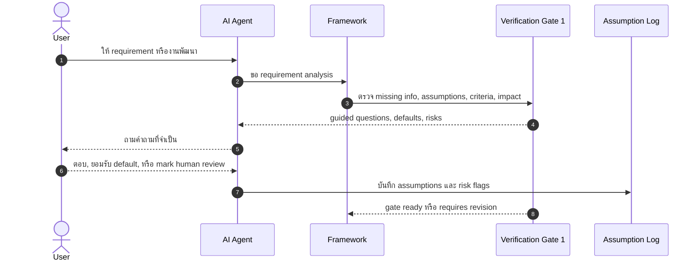

**การนำทาง:** ดู [ภาพรวม](PRODUCT_VISION.md)

# การตรวจสอบและความเสี่ยง

เอกสารนี้อธิบาย verification gates, risk-based approval, human review handoff, verification dimensions และบทบาทของ RAG ใน framework แบบ AI-managed, verification-governed

---

## Verification Gates

Verification gates คือจุดหยุดที่บังคับให้ระบบผูก claims ของ AI กับ evidence ก่อนให้ผู้ใช้ trust หรือ continue จุดประสงค์ไม่ใช่ทำให้ทุกอย่างช้า แต่เพื่อป้องกันการเดินหน้าจาก output ที่ยังไม่ถูกตรวจ

Gate หลัก:

1. **Gate 1: Requirement, Acceptance Criteria, Architecture, and Impact Review**
   - ตรวจว่า requirement ชัดพอหรือยัง
   - ระบุ missing information และ assumptions
   - สร้าง acceptance criteria ที่ test/verify ได้
   - วิเคราะห์ architecture, affected files, API/schema impact และ risk areas
   - ถ้าไม่พร้อม ให้ถาม guided questions ใช้ defaults ที่บันทึกไว้ หรือ mark human review

2. **Gate 2: Code Quality, Security, Build, Test, and Maintainability**
   - ตรวจ diff, build, typecheck, lint และ tests ที่มี
   - เช็ค acceptance criteria, security-sensitive paths และ maintainability
   - แยก findings เป็น Critical, High, Medium, Low และ Informational
   - ตัดสินว่าจะ repair, stop หรือ escalate

3. **Gate 3: Production Readiness**
   - ตรวจ deployment, configuration, auth, data handling, observability, rollback และ operational concerns
   - ป้องกันการอ้าง production-ready หรือ secure โดยไม่มี evidence
   - flag human review สำหรับ security, migration, data deletion, sensitive data และ production-critical decisions

Guided Verification Gate สำหรับผู้ใช้ประสบการณ์น้อยควรให้ defaults ที่ปลอดภัย คำอธิบายสั้น ๆ และ assumption log แทนการถามคำถามเชิงเทคนิคที่ผู้ใช้ยังตัดสินไม่ได้

## Guided Verification Gate 1 Sequence Diagram



## Acceptance Criteria Generation

Acceptance criteria กำหนดว่าอะไรต้องเป็นจริงจึงถือว่างานเสร็จ และเป็นฐานของ verification, tests และ stop decisions

เกณฑ์ที่ดีควร:

- สังเกตหรือทดสอบได้
- แยก success, failure, unauthorized และ edge cases
- เชื่อมกับ requirement และ risk level
- ระบุ behavior ที่ user เห็นและ behavior ระดับ API/server ที่ต้อง enforce
- ช่วยตัดสินว่า AI ควร stop, continue หรือส่ง human review

ตัวอย่าง:

```markdown
# Acceptance Criteria: Admin-only appointment deletion

- Admin can delete appointment.
- Normal user cannot delete appointment.
- Unauthenticated user receives 401.
- Non-admin user receives 403.
- Authorization must be checked at the API level.
- Build and typecheck must pass.
```

## Test-Aware Workflow

ระบบควรทำให้ผู้ใช้คิดเรื่อง test ก่อนและหลัง implementation:

- ก่อน implement: ระบุ acceptance criteria และ test plan คร่าว ๆ
- ระหว่าง implement: ให้ AI ทำเฉพาะ code change ที่สอดคล้องกับ approved plan
- หลัง implement: รัน checks ที่มีและรายงาน checks ที่ขาด
- ถ้า tests ไม่มีหรือไม่เพียงพอ: รายงาน residual risk แทนการ claim correctness

Test-aware ไม่ได้หมายความว่าทุก prototype ต้องมี test ครบทุกแบบ แต่หมายความว่าระบบต้องรู้ว่ามี evidence อะไรและยังขาดอะไร

## Risk-Based Approval

ก่อน AI แก้ code ระบบควรจัดระดับความเสี่ยง:

- **Low** — เปลี่ยนเล็ก scoped ชัด ไม่มี auth/data/schema/production impact
- **Medium** — แตะหลายไฟล์, behavior สำคัญ, dependency, test gaps หรือ maintainability concerns
- **High** — authentication, authorization, sensitive data, deletion, migrations, secrets, payment, production config หรือ broad architecture changes

Low risk อาจ proceed ด้วย user confirmation แบบเบา Medium risk ควรแสดง plan/diff/risk ชัดเจนก่อน approve High risk ต้อง explicit approval และมักต้อง human review trigger

## Human Review Handoff Package

เมื่อ AI ควรหยุดและให้มนุษย์รีวิว ระบบต้องสร้าง handoff ที่ช่วยให้ reviewer เข้าใจเร็ว:

```markdown
# Human Review Handoff

## Task

สิ่งที่ผู้ใช้ต้องการ และ acceptance criteria ที่ตกลงกัน

## AI Changes

- ไฟล์ที่เปลี่ยน
- เหตุผลของการเปลี่ยน
- decisions สำคัญ

## Verification Evidence

- build/typecheck/lint/test results
- checks ที่ไม่ได้รัน
- findings และ severity

## Remaining Risks

- unresolved errors
- assumptions ที่ยังไม่ confirm
- production/security concerns

## Questions for Reviewer

- คำถามเฉพาะที่ต้องการ judgment ของมนุษย์
```

## Main Verification Dimensions

มิติการตรวจสอบหลัก:

- **Requirement fit** — implementation ตรง requirement และ acceptance criteria หรือไม่
- **Functional correctness** — behavior หลักทำงานตามที่ตั้งใจหรือไม่
- **Security** — authn/authz, data exposure, input handling, secrets และ abuse cases
- **Data integrity** — schema, migrations, constraints, deletion และ consistency
- **Build and type safety** — build/typecheck ผ่านหรือมี risk อะไรเหลือ
- **Test evidence** — มี tests อะไร ผ่านไหม และ gaps คืออะไร
- **Maintainability** — code clarity, coupling, duplication, boundaries และ future change cost
- **Production readiness** — config, deployment, monitoring, rollback, privacy และ operational concerns
- **User learning** — ผู้ใช้เข้าใจ decisions, trade-offs และ risks มากขึ้นหรือไม่

## Role of RAG

RAG อาจช่วยดึง guideline, project rules, framework policies, prior decisions หรือ domain notes เพื่อ support verification แต่ไม่ใช่ core research contribution และไม่ควรถูกใช้แทน evidence จาก code/tools

RAG มีประโยชน์เมื่อ:

- ต้องดึง rule หรือ guideline ที่เกี่ยวข้อง
- ต้องค้น prior decision logs หรือ past verification reports
- ต้องลด context โดยเลือกเอกสารที่เกี่ยวข้องกับ task

RAG ยังต้องถูกกำกับด้วย verification: retrieved content อาจล้าสมัย ไม่เกี่ยวข้อง หรือถูกใช้ผิด context ระบบจึงควรบันทึก source, confidence และ assumptions ที่มาจาก retrieval

