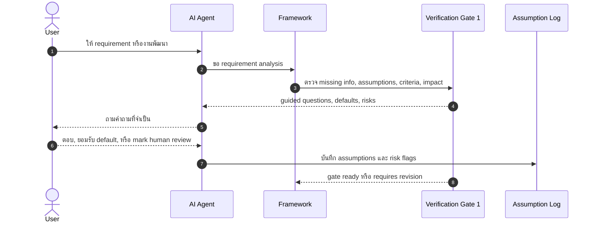

**การนำทาง:** ดู [ภาพรวม](PRODUCT_VISION.md)

# การตรวจสอบและความเสี่ยง

เอกสารนี้อธิบาย verification gates, risk-based approval, human review handoff, verification dimensions และบทบาทของ RAG ใน framework แบบ AI-managed, verification-governed

---

## Verification Gates

Verification gates คือจุดหยุดที่บังคับให้ระบบผูก claims ของ AI กับ evidence ก่อนให้ผู้ใช้ trust หรือ continue จุดประสงค์ไม่ใช่ทำให้ทุกอย่างช้า แต่เพื่อป้องกันการเดินหน้าจาก output ที่ยังไม่ถูกตรวจ

Gate หลัก:

1. **Gate 1: Requirement, Acceptance Criteria, Architecture, and Impact Review**
   - ตรวจว่า requirement ชัดพอหรือยัง
   - ระบุ missing information และ assumptions
   - สร้าง acceptance criteria ที่ test/verify ได้
   - วิเคราะห์ architecture, affected files, API/schema impact และ risk areas
   - ถ้าไม่พร้อม ให้ถาม guided questions ใช้ defaults ที่บันทึกไว้ หรือ mark human review

2. **Gate 2: Code Quality, Security, Build, Test, and Maintainability**
   - ตรวจ diff, build, typecheck, lint และ tests ที่มี
   - เช็ค acceptance criteria, security-sensitive paths และ maintainability
   - แยก findings เป็น Critical, High, Medium, Low และ Informational
   - ตัดสินว่าจะ repair, stop หรือ escalate

3. **Gate 3: Production Readiness**
   - ตรวจ deployment, configuration, auth, data handling, observability, rollback และ operational concerns
   - ป้องกันการอ้าง production-ready หรือ secure โดยไม่มี evidence
   - flag human review สำหรับ security, migration, data deletion, sensitive data และ production-critical decisions

Guided Verification Gate สำหรับผู้ใช้ประสบการณ์น้อยควรให้ defaults ที่ปลอดภัย คำอธิบายสั้น ๆ และ assumption log แทนการถามคำถามเชิงเทคนิคที่ผู้ใช้ยังตัดสินไม่ได้

## Guided Verification Gate 1 Sequence Diagram



## Acceptance Criteria Generation

Acceptance criteria กำหนดว่าอะไรต้องเป็นจริงจึงถือว่างานเสร็จ และเป็นฐานของ verification, tests และ stop decisions

เกณฑ์ที่ดีควร:

- สังเกตหรือทดสอบได้
- แยก success, failure, unauthorized และ edge cases
- เชื่อมกับ requirement และ risk level
- ระบุ behavior ที่ user เห็นและ behavior ระดับ API/server ที่ต้อง enforce
- ช่วยตัดสินว่า AI ควร stop, continue หรือส่ง human review

ตัวอย่าง:

```markdown
# Acceptance Criteria: Admin-only appointment deletion

- Admin can delete appointment.
- Normal user cannot delete appointment.
- Unauthenticated user receives 401.
- Non-admin user receives 403.
- Authorization must be checked at the API level.
- Build and typecheck must pass.
```

## Test-Aware Workflow

ระบบควรทำให้ผู้ใช้คิดเรื่อง test ก่อนและหลัง implementation:

- ก่อน implement: ระบุ acceptance criteria และ test plan คร่าว ๆ
- ระหว่าง implement: ให้ AI ทำเฉพาะ code change ที่สอดคล้องกับ approved plan
- หลัง implement: รัน checks ที่มีและรายงาน checks ที่ขาด
- ถ้า tests ไม่มีหรือไม่เพียงพอ: รายงาน residual risk แทนการ claim correctness

Test-aware ไม่ได้หมายความว่าทุก prototype ต้องมี test ครบทุกแบบ แต่หมายความว่าระบบต้องรู้ว่ามี evidence อะไรและยังขาดอะไร

## Risk-Based Approval

ก่อน AI แก้ code ระบบต้องจัดระดับความเสี่ยงของงานนั้น การ classification นี้กำหนด approval path และ verification requirements

### Risk Classification Rubric

| ระดับ | เกณฑ์ที่ต้องครบ (ถ้าข้อใดข้อหนึ่งเป็นจริง = ระดับนั้น) |
| --- | --- |
| **Low** | ≤2 ไฟล์ที่เปลี่ยน, ไม่แตะ auth/authz, ไม่มี data deletion, ≤50 บรรทัด, ไม่มี dependency ใหม่, ไม่แตะ schema |
| **Medium** | 3–10 ไฟล์ OR มี dependency ใหม่ OR แตะ schema ที่มีอยู่ OR test gap OR business logic สำคัญ |
| **High** | auth/authz, deletion, migration, secret handling, payment, schema change, external API ที่มี side effects, production config |

ถ้าเกณฑ์ข้อใดข้อหนึ่งใน High เป็นจริง = High เสมอ ไม่ว่าจะมีกี่ไฟล์

### Approval Requirements

| ระดับ | สิ่งที่ต้องทำก่อนเริ่ม implement |
| --- | --- |
| Low | User รับทราบ plan แบบเบา (implicit acknowledgement) |
| Medium | User ยืนยัน plan + diff preview ก่อน apply (TK-010) |
| High | User ยืนยัน plan + diff preview + Human Review Handoff Package เมื่อเสร็จ (TK-011) |

## Finding Severity Levels

Gate 2 จัดประเภท findings ก่อนตัดสิน repair หรือ stop

### Pre-Report Confidence Gate

ก่อน flag finding ใดก็ตาม Verifier ต้องตอบ 4 คำถาม:

1. อ้างไฟล์และ line number ที่แน่ชัดได้ไหม?
2. อธิบาย failure mode ที่เป็นรูปธรรมได้ไหม (input → state → bad outcome)?
3. อ่าน surrounding context แล้วหรือยัง — callers, imports และ tests?
4. severity defensible จริงไหมเทียบกับ actual risk ไม่ใช่แค่ pattern ที่เห็น?

ถ้าคำตอบใดไม่ชัด → downgrade severity ลงหนึ่งระดับหรือ drop finding ออกเลย การ review ที่ไม่พบ findings คือผลลัพธ์ที่ valid และคาดหวังได้ findings ที่แต่งขึ้นและ speculative nits ลดความน่าเชื่อถือของ Verifier และสร้าง repair cycles ที่ไม่จำเป็น

| ระดับ | ความหมาย | ตัวอย่าง | การตัดสินใจ |
| --- | --- | --- | --- |
| **Critical** | ต้อง repair หรือ escalate ก่อน gate pass | auth bypass, secret leak, data loss, build broken | ห้าม pass gate — ต้อง repair หรือ escalate |
| **High** | ควร repair หรือ escalate ก่อน gate pass | failing test บน critical path, missing server-side authz | ต้อง repair หรือ escalate ก่อนรายงาน complete |
| **Medium** | อาจ repair ได้ถ้า user approve และอยู่ใน scope | unused code, minor type widening, missing edge-case error handling | repair ได้ถ้า scope อนุญาต ไม่ block gate |
| **Low** | รายงานแต่ไม่ repair อัตโนมัติ | formatting, naming style, non-blocking lint warning | log ไว้ ไม่บังคับ repair |
| **Informational** | รายงานเท่านั้น | dependency version note, suggestion สำหรับ future improvement | ไม่ต้องทำอะไร |

หลัง fix High/Critical findings หมดแล้ว ระบบควร stop แม้ยังมี Medium/Low เหลืออยู่ (ดู TK-009)

## Confidence Levels

ทุก AI output (plan, risk classification, tech stack recommendation, report) ต้องมี confidence label:

| ระดับ | ความหมาย | เมื่อใช้ |
| --- | --- | --- |
| **High** | pattern ที่ established ชัดเจน, evidence แน่น, ambiguity ต่ำ | standard CRUD, well-known library usage, clear requirements |
| **Medium** | approach สมเหตุสมผลแต่มี assumptions อยู่ ผู้ใช้ควรตรวจจุดสำคัญ | บางส่วนของ requirement ยังไม่ชัด, pattern ที่ใหม่สำหรับ codebase นี้ |
| **Low** | มี uncertainty สูง, ขอแนะนำให้ human review ก่อนดำเนินต่อ | auth design, migration strategy, production deployment decision |

Confidence label ต้องระบุ rationale ด้วย ไม่ใช่แค่ตัวอักษร ตัวอย่าง:

```
Confidence: Medium
Reason: Authentication flow matches common Next.js patterns, but session
expiration policy was not specified by the user — logged as assumption A-003.
```

## Human Review Handoff Package

เมื่อ AI ควรหยุดและให้มนุษย์รีวิว ระบบต้องสร้าง handoff ที่ช่วยให้ reviewer เข้าใจเร็ว:

```markdown
# Human Review Handoff

## Task

สิ่งที่ผู้ใช้ต้องการ และ acceptance criteria ที่ตกลงกัน

## AI Changes

- ไฟล์ที่เปลี่ยน
- เหตุผลของการเปลี่ยน
- decisions สำคัญ

## Verification Evidence

- build/typecheck/lint/test results
- checks ที่ไม่ได้รัน
- findings และ severity

## Remaining Risks

- unresolved errors
- assumptions ที่ยังไม่ confirm
- production/security concerns

## Questions for Reviewer

- คำถามเฉพาะที่ต้องการ judgment ของมนุษย์
```

## Main Verification Dimensions

มิติการตรวจสอบหลัก:

- **Requirement fit** — implementation ตรง requirement และ acceptance criteria หรือไม่
- **Functional correctness** — behavior หลักทำงานตามที่ตั้งใจหรือไม่
- **Security** — authn/authz, data exposure, input handling, secrets และ abuse cases
- **Data integrity** — schema, migrations, constraints, deletion และ consistency
- **Build and type safety** — build/typecheck ผ่านหรือมี risk อะไรเหลือ
- **Test evidence** — มี tests อะไร ผ่านไหม และ gaps คืออะไร
- **Maintainability** — code clarity, coupling, duplication, boundaries และ future change cost
- **Production readiness** — config, deployment, monitoring, rollback, privacy และ operational concerns
- **User learning** — ผู้ใช้เข้าใจ decisions, trade-offs และ risks มากขึ้นหรือไม่

## Role of RAG

RAG อาจช่วยดึง guideline, project rules, framework policies, prior decisions หรือ domain notes เพื่อ support verification แต่ไม่ใช่ core research contribution และไม่ควรถูกใช้แทน evidence จาก code/tools

RAG มีประโยชน์เมื่อ:

- ต้องดึง rule หรือ guideline ที่เกี่ยวข้อง
- ต้องค้น prior decision logs หรือ past verification reports
- ต้องลด context โดยเลือกเอกสารที่เกี่ยวข้องกับ task

RAG ยังต้องถูกกำกับด้วย verification: retrieved content อาจล้าสมัย ไม่เกี่ยวข้อง หรือถูกใช้ผิด context ระบบจึงควรบันทึก source, confidence และ assumptions ที่มาจาก retrieval

