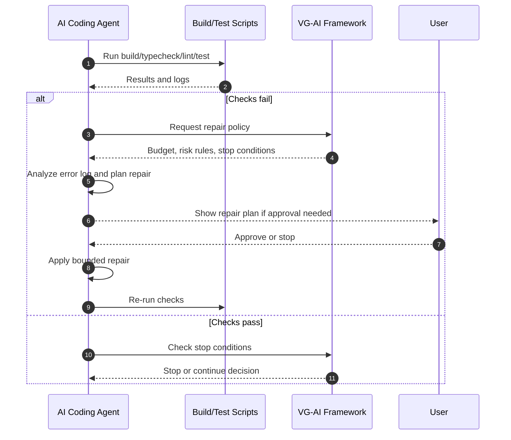

**การนำทาง:** ดู [ภาพรวม](PRODUCT_VISION.md)

# Build, Repair, Stop Conditions และ Execution Controls ที่เกี่ยวข้อง

เอกสารนี้อธิบาย build-and-repair loop, stop conditions, cost/token optimization, versioning, diff preview, rollback และ failure mode report

---

## Build-and-Repair Loop with Stop Conditions

Build-and-Repair Loop คือกลไกที่รัน checks วิเคราะห์ failures ซ่อมแบบจำกัดขอบเขต และรัน checks ซ้ำ โดยมี stop conditions เพื่อป้องกันการแก้ต่อไม่รู้จบ

ขั้นตอนหลัก:

1. รัน checks ที่มี: build, typecheck, lint, tests หรือ scripts ที่ project ระบุ
2. เก็บผลลัพธ์และ logs
3. ถ้า pass ให้เข้าสู่ stop-condition check และ verification gates
4. ถ้า fail ให้ compress error log และระบุ root cause ที่น่าจะเป็น
5. สร้าง repair plan ที่ scoped และอ้าง evidence
6. ตรวจ risk level ของ repair
7. ขอ approval ถ้า risk เป็น medium/high หรือแตะพื้นที่ sensitive
8. apply repair ภายใน repair budget — **สูงสุด 3 iterations ต่อ task**
9. รัน checks ซ้ำ
10. หยุดเมื่อ pass, budget หมด, risk สูงขึ้น, uncertainty สูงเกิน หรือ human review จำเป็น

### Repair Budget

**Budget = 3 iterations สูงสุด** นับจากครั้งแรกที่ gate fail หากยังไม่ผ่านหลัง 3 ครั้ง ต้องหยุดและ escalate ทันที ห้าม repair เพิ่มโดยไม่มี user approval เปิด budget ใหม่

Budget จะ reset ก็ต่อเมื่อ user approve scope ใหม่หรืองานใหม่อย่างชัดเจน

### Stop Conditions

| เงื่อนไขที่ trigger stop | เหตุผล |
| --- | --- |
| ไม่มี Critical หรือ High severity findings เหลือ | งานเสร็จเพียงพอสำหรับ scope ที่อนุมัติ |
| Repair budget ครบ 3 iterations แล้ว | ป้องกัน uncontrolled repair loop |
| Repair เริ่มแตะไฟล์นอก approved plan | scope drift — ต้อง user approval ก่อน |
| Error เปลี่ยนเป็น security/data/schema concern | risk ระดับ High → ต้อง human review |
| AI อธิบาย root cause พร้อม evidence ไม่ได้ | ไม่มีข้อมูลเพียงพอจะ repair อย่างปลอดภัย |
| Issue ที่เหลืออยู่นอก scope ของ task | แก้ถูก task ผิด → log เป็น future task |
| การแก้เพิ่มเสี่ยง regression มากกว่าประโยชน์ | cost/benefit ไม่คุ้ม |

เมื่อ stop ระบบต้องรายงาน stop decision พร้อม evidence เช่น:

```
Decision: Stop Automated Repair
Reason:
- Build, typecheck และ tests ผ่านแล้ว
- ไม่มี Critical หรือ High findings เหลือ
- Remaining: 2 Medium findings (unused variable, minor type widening)
Recommendation:
- ไม่ต้อง continue AI repair
- Medium findings สามารถ address ได้ใน task ถัดไปถ้าต้องการ
```

### Finding Severity Levels (สำหรับ Build-and-Repair)

| ระดับ | การตัดสินใจ Repair |
| --- | --- |
| Critical | ต้อง repair หรือ escalate ก่อน gate pass — ห้าม stop จนกว่าจะ resolve |
| High | ควร repair หรือ escalate ก่อนรายงาน complete |
| Medium | Repair ได้ถ้าอยู่ใน scope และ user approve |
| Low | Log ไว้ ไม่ repair อัตโนมัติ |
| Informational | รายงานเท่านั้น |

คำจำกัดความเต็มของแต่ละระดับดู [doc 05 — Finding Severity Levels](05_VERIFICATION_AND_RISK.md#finding-severity-levels)

ระบบควรระวังไม่ให้ AI “polish” code ต่อหลัง evidence เพียงพอแล้ว และไม่ควรเปลี่ยน requirement หรือ scope เงียบ ๆ ระหว่าง repair

## Cost and Token Optimization Layer

ชั้น cost/token ลด calls และ context ที่ไม่จำเป็น โดยยังรักษา verification quality

เทคนิคที่ใช้ได้:

- **Selective context retrieval** — เลือกเฉพาะไฟล์และ docs ที่เกี่ยวข้องกับ task
- **Codebase map** — เก็บโครงสร้าง project, modules, scripts และ ownership hints
- **Cached summaries** — reuse summaries ของไฟล์หรือ subsystems ที่ไม่เปลี่ยน
- **Diff-based repair context** — สำหรับ repair ให้ส่ง diff, failing logs และ affected files แทนทั้ง repo
- **Error-log compression** — สรุป logs ให้เหลือ root errors, stack traces สำคัญ และ commands
- **Model routing** — map model tier กับ governance level และ risk อย่างชัดเจน:

  | Model tier | ใช้สำหรับ |
  | --- | --- |
  | **Small / cheap** (เช่น Haiku) | Observation logging, log compression, summary formatting, pattern detection จาก `observations.jsonl`, cost tracking |
  | **Mid-tier** (เช่น Sonnet) | Planner, Verifier, Rule Workshop generation call, acceptance criteria, Gate 2 review |
  | **Large** (เช่น Opus) | High-risk Arbiter, Level 3 critique-independence calls, stop-condition decisions สำหรับ High-risk tasks, Rule Workshop critique call เมื่อ Level 3 กำหนด |

  Governance level map กับ model tier: Level 1 = deterministic tools เท่านั้น; Level 2 = small/mid-tier; Level 3 Low/Medium = mid-tier; Level 3 High = large model สำหรับ arbitration และ critique
- **Repair/token budgets** — จำกัดจำนวน iterations, tokens และ cost ต่อ task

Optimization ต้องไม่ลด evidence ที่จำเป็น เช่น ไม่ควรข้าม build/test เพียงเพื่อประหยัด tokens และต้องบันทึกว่า context ใดถูกเลือกหรือไม่ได้เลือก

## Build-and-Repair Loop Sequence Diagram



## Versioning, Diff Preview, and Rollback

ก่อน AI แก้ code ระบบควรสร้าง snapshot, branch, worktree หรือ checkpoint ตามความเหมาะสม เพื่อให้ inspect และ rollback ได้

Diff preview ควรแสดง:

- ไฟล์ที่สร้าง แก้ หรือลบ
- เหตุผลของแต่ละ change
- relation กับ acceptance criteria
- risk level
- checks ที่รันและผลลัพธ์
- unresolved assumptions หรือ risks

Rollback ต้องเป็นทางเลือกที่ชัดเจนเมื่อ repair ล้มเหลว, scope drift, risk เพิ่มขึ้น หรือผู้ใช้ไม่ approve diff

## Failure Mode Report

เมื่อ task ทำให้เสร็จอย่างปลอดภัยไม่ได้ ระบบควรหยุดและสร้าง report:

```markdown
# Failure Mode Report

## Status

Automated implementation stopped.

## What Failed

ระบุ checks หรือ acceptance criteria ที่ fail

## What Was Attempted

- repair attempts
- files changed
- commands run

## Current Error

error ปัจจุบันหรือ finding สำคัญ

## Likely Root Cause

สาเหตุที่เป็นไปได้พร้อม confidence

## Why Automated Repair Stopped

- repair budget exhausted
- risk too high
- human review required
- insufficient evidence

## Recommended Next Step

สิ่งที่ human reviewer หรือผู้ใช้ควรทำต่อ
```

