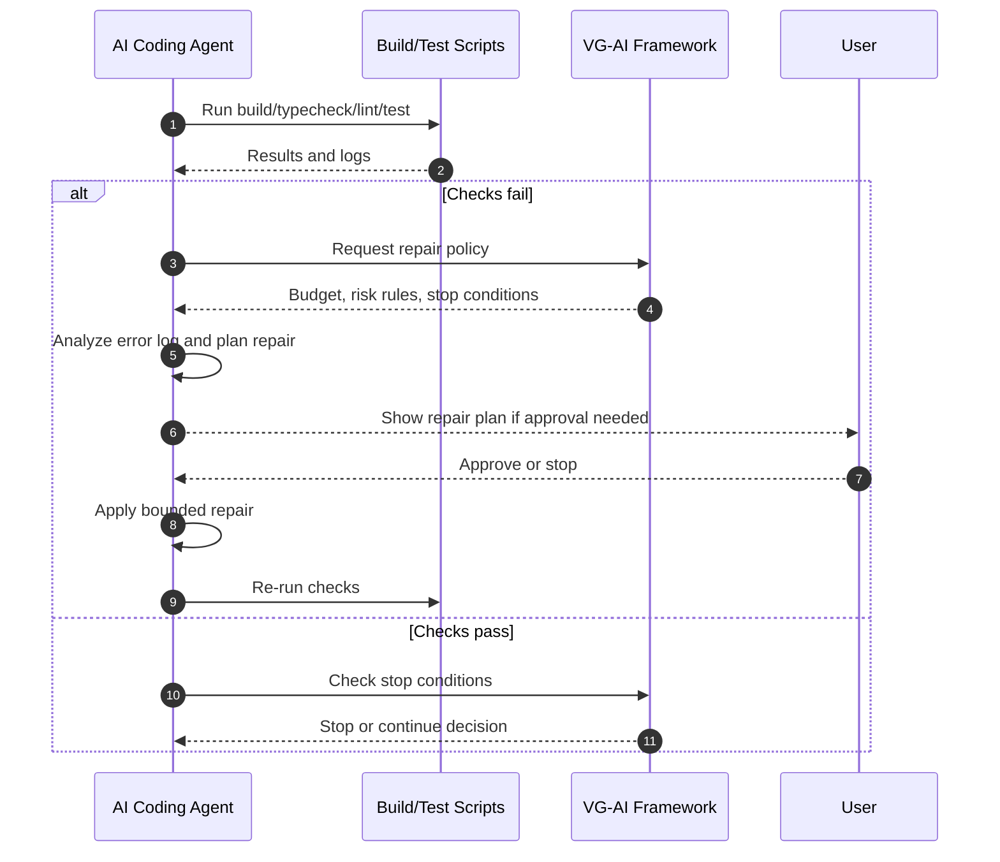

**การนำทาง:** ดู [ภาพรวม](PRODUCT_VISION.md)

# Build, Repair, Stop Conditions และ Execution Controls ที่เกี่ยวข้อง

เอกสารนี้อธิบาย build-and-repair loop, stop conditions, cost/token optimization, versioning, diff preview, rollback และ failure mode report

---

## Build-and-Repair Loop with Stop Conditions

Build-and-Repair Loop คือกลไกที่รัน checks วิเคราะห์ failures ซ่อมแบบจำกัดขอบเขต และรัน checks ซ้ำ โดยมี stop conditions เพื่อป้องกันการแก้ต่อไม่รู้จบ

ขั้นตอนหลัก:

1. รัน checks ที่มี: build, typecheck, lint, tests หรือ scripts ที่ project ระบุ
2. เก็บผลลัพธ์และ logs
3. ถ้า pass ให้เข้าสู่ stop-condition check และ verification gates
4. ถ้า fail ให้ compress error log และระบุ root cause ที่น่าจะเป็น
5. สร้าง repair plan ที่ scoped และอ้าง evidence
6. ตรวจ risk level ของ repair
7. ขอ approval ถ้า risk เป็น medium/high หรือแตะพื้นที่ sensitive
8. apply repair ภายใน repair budget
9. รัน checks ซ้ำ
10. หยุดเมื่อ pass, budget หมด, risk สูงขึ้น, uncertainty สูงเกิน หรือ human review จำเป็น

Stop conditions สำคัญ:

- required checks ผ่านแล้ว
- findings ที่เหลือ low severity หรือ informational
- issue ที่เหลืออยู่นอก scope ของ task
- repair budget หมด
- repair เริ่มแตะ files/areas ที่ไม่อยู่ใน approved plan
- error เปลี่ยนไปเป็น security/data/schema/production concern
- AI ไม่สามารถอธิบาย root cause พร้อม evidence ได้
- การแก้เพิ่มมีโอกาสสร้าง regression มากกว่าประโยชน์

ระบบควรระวังไม่ให้ AI “polish” code ต่อหลัง evidence เพียงพอแล้ว และไม่ควรเปลี่ยน requirement หรือ scope เงียบ ๆ ระหว่าง repair

## Cost and Token Optimization Layer

ชั้น cost/token ลด calls และ context ที่ไม่จำเป็น โดยยังรักษา verification quality

เทคนิคที่ใช้ได้:

- **Selective context retrieval** — เลือกเฉพาะไฟล์และ docs ที่เกี่ยวข้องกับ task
- **Codebase map** — เก็บโครงสร้าง project, modules, scripts และ ownership hints
- **Cached summaries** — reuse summaries ของไฟล์หรือ subsystems ที่ไม่เปลี่ยน
- **Diff-based repair context** — สำหรับ repair ให้ส่ง diff, failing logs และ affected files แทนทั้ง repo
- **Error-log compression** — สรุป logs ให้เหลือ root errors, stack traces สำคัญ และ commands
- **Model routing** — ใช้ model เบากับ summary/log tasks และ model แข็งกับ risk/judgment tasks เมื่อมี
- **Repair/token budgets** — จำกัดจำนวน iterations, tokens และ cost ต่อ task

Optimization ต้องไม่ลด evidence ที่จำเป็น เช่น ไม่ควรข้าม build/test เพียงเพื่อประหยัด tokens และต้องบันทึกว่า context ใดถูกเลือกหรือไม่ได้เลือก

## Build-and-Repair Loop Sequence Diagram



## Versioning, Diff Preview, and Rollback

ก่อน AI แก้ code ระบบควรสร้าง snapshot, branch, worktree หรือ checkpoint ตามความเหมาะสม เพื่อให้ inspect และ rollback ได้

Diff preview ควรแสดง:

- ไฟล์ที่สร้าง แก้ หรือลบ
- เหตุผลของแต่ละ change
- relation กับ acceptance criteria
- risk level
- checks ที่รันและผลลัพธ์
- unresolved assumptions หรือ risks

Rollback ต้องเป็นทางเลือกที่ชัดเจนเมื่อ repair ล้มเหลว, scope drift, risk เพิ่มขึ้น หรือผู้ใช้ไม่ approve diff

## Failure Mode Report

เมื่อ task ทำให้เสร็จอย่างปลอดภัยไม่ได้ ระบบควรหยุดและสร้าง report:

```markdown
# Failure Mode Report

## Status

Automated implementation stopped.

## What Failed

ระบุ checks หรือ acceptance criteria ที่ fail

## What Was Attempted

- repair attempts
- files changed
- commands run

## Current Error

error ปัจจุบันหรือ finding สำคัญ

## Likely Root Cause

สาเหตุที่เป็นไปได้พร้อม confidence

## Why Automated Repair Stopped

- repair budget exhausted
- risk too high
- human review required
- insufficient evidence

## Recommended Next Step

สิ่งที่ human reviewer หรือผู้ใช้ควรทำต่อ
```

