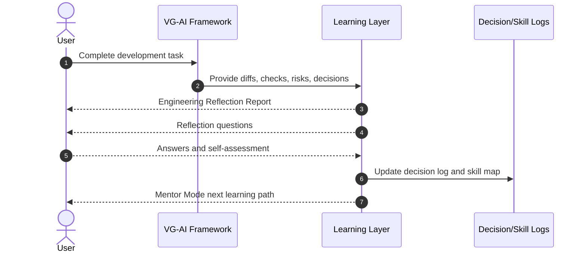

**การนำทาง:** ดู [ภาพรวม](PRODUCT_VISION.md)

# การเรียนรู้ Reflection และการพัฒนาสกิล

เอกสารนี้อธิบายกลไกที่ทำให้ AI-assisted development กลายเป็น learning process ไม่ใช่แค่การให้ AI สร้าง code ดูมิติด้าน judgment ใน [07 Engineering Thinking and Judgment](07_ENGINEERING_THINKING_AND_JUDGMENT.md)

---

## Engineering Reflection Report

หลัง task สำคัญ ระบบควรสร้าง Engineering Reflection Report เพื่ออธิบายงานในภาษาเชิงวิศวกรรมที่ผู้ใช้เรียนรู้ได้

รายงานควรครอบคลุม:

- AI เข้าใจ requirement ว่าอะไร
- acceptance criteria ที่ใช้ตัดสินความสำเร็จ
- files/modules ที่เปลี่ยนและเหตุผล
- architecture หรือ design decision ที่เกี่ยวข้อง
- alternatives ที่พิจารณา
- trade-offs และ risks
- verification evidence เช่น build, typecheck, lint, tests และ manual review notes
- repair attempts และเหตุผลที่ repair ต่อหรือหยุด
- stop decision และเหตุผล
- human review needs
- learning topics ที่ผู้ใช้ควรศึกษา

ตัวอย่างโครงสร้าง:

```markdown
# Engineering Reflection Report

## Task Summary

สิ่งที่ต้องทำและ scope ที่อนุมัติ

## What Changed

ไฟล์และ behavior ที่เปลี่ยน

## Why It Changed

rationale, alternatives และ trade-offs

## Verification Evidence

checks ที่รัน ผลลัพธ์ และ checks ที่ขาด

## Repair History

สิ่งที่ fail, สิ่งที่ซ่อม, iterations และเหตุผลที่หยุด

## Risks and Human Review

remaining risks, assumptions และ review questions

## Learning Topics

topics ที่เกี่ยวข้อง เช่น authorization, migrations, tests, error handling
```

## Engineering Reflection Questions

ระบบควรถามคำถามเพื่อฝึก judgment เช่น:

- ก่อนเห็นคำตอบของ AI คุณคิดว่า requirement สำคัญที่สุดคืออะไร?
- assumptions ใดที่คุณยอมรับเอง และข้อไหน AI เลือก default?
- ถ้าเป็น production คุณต้องขอ evidence เพิ่มอะไร?
- risk ใดควร block งาน และ risk ใด acceptable สำหรับ prototype?
- คุณจะอธิบาย trade-off นี้ให้ reviewer ฟังอย่างไร?
- คุณเห็นสัญญาณใดที่บอกว่า AI ควรหยุดแก้ต่อ?
- คุณเข้าใจ diff ทั้งหมดหรือมีส่วนที่ต้องถาม human reviewer?

คำถามควรปรับตาม task และ risk ไม่ใช่เป็น checklist เดิมทุกครั้ง

## Project Decision Log

Decision log เก็บ engineering rationale ข้าม sessions เพื่อให้โปรเจกต์ไม่สูญเสีย context

```markdown
# Project Decision Log

## Decision 001: Use role-based access control

Status: Accepted

Context:
ระบบมี patient, doctor และ admin roles ที่ต้องมี permissions ต่างกัน

Decision:
ใช้ role-based access control และ enforce authorization ที่ server/API layer

Alternatives:
- UI-only role hiding: rejected เพราะไม่ปลอดภัย
- permission table ละเอียด: deferred เพราะ prototype scope

Trade-offs:
- ง่ายต่อการเรียนรู้และ verify
- อาจต้อง refine ก่อน production

Risks:
- ต้อง review role model ถ้าใช้ข้อมูลผู้ป่วยจริง
```

## Rubric-Based Scoring

rubric ช่วยให้ผู้ใช้ประเมินงานอย่างสม่ำเสมอ ตัวอย่าง criteria:

- Requirement clarity
- Acceptance criteria quality
- Architecture fit
- Security awareness
- Test and verification evidence
- Maintainability
- Risk classification
- Stop/continue judgment
- Human review readiness
- Reflection quality

คะแนนไม่ควรถูกใช้เป็น proof ว่างานถูกต้อง แต่เป็นเครื่องมือเรียนรู้และเปรียบเทียบ progress

## Skill Progression Map

ระบบควร map task กับ skill areas และ track exposure:

- Requirements and product thinking
- Architecture and boundaries
- Data modeling
- Authentication and authorization
- Security and privacy
- Testing strategy
- Build/typecheck/lint discipline
- Error diagnosis and repair
- Maintainability and refactoring
- Deployment and production readiness
- Observability and rollback
- Risk-based decision making
- Human review communication

Skill map ควรบันทึกว่าผู้ใช้เจอ skill ใดใน task นี้ ตอบ reflection ได้ดีแค่ไหน และควรฝึกอะไรต่อ

## Repeated Reflection Workflow

Repeated Reflection คือการให้ผู้ใช้ reason ก่อนและหลัง AI feedback:

1. ก่อน AI วิเคราะห์ ให้ผู้ใช้ตอบว่าคิดว่า risk, plan และ tests ควรเป็นอะไร
2. AI วิเคราะห์และให้ report
3. ผู้ใช้เทียบคำตอบของตนกับ report
4. ระบบถามว่าผู้ใช้เปลี่ยนความคิดตรงไหนและเพราะ evidence อะไร
5. ระบบบันทึก learning observations ลง skill profile

กลไกนี้ช่วยลดการพึ่ง AI แบบ passive และฝึกให้ผู้ใช้ค่อย ๆ internalize judgment

## Mentor Mode

Mentor Mode แนะนำ next step โดยอิง task, risks, skill gaps และ user progress เช่น:

- ถ้า user พลาด authorization risk ให้เสนอ task ฝึก authz tests
- ถ้า user ไม่เข้าใจ migration risk ให้เสนอ learning note และ small exercise
- ถ้า task ผ่านแต่ tests ขาด ให้เสนอ next task เพิ่ม test coverage
- ถ้า high-risk issue ถูก escalate ให้ช่วยเตรียม questions สำหรับ reviewer

Mentor Mode ไม่ควรแสร้งว่าเป็น senior human mentor แต่ควรเป็น structured guide ที่อิง evidence และ artifacts

## Post-Task Learning Workflow

หลัง task:

1. สร้าง Trust/Risk Report และ Engineering Reflection Report
2. อัปเดต Decision Log
3. map task กับ Skill Progression Map
4. ถาม repeated reflection questions
5. เสนอ next learning path หรือ next development task
6. บันทึก open questions สำหรับ human review หรือ future tasks

## การ trigger Reflection อัตโนมัติผ่าน Hook

Engineering Reflection Report ไม่ควรรอให้ user ขอเอง และไม่ควรพึ่งให้ agent สร้าง reconstruction จาก working memory — ทั้งสองวิธีมีช่องโหว่เสมอ

framework ใช้ **Stop hook** trigger reflection อัตโนมัติเมื่อ task จบ hook อ่านจาก `.vgai/observations.jsonl` — append-only event log ที่ PreToolUse และ PostToolUse hooks เก็บไว้ตลอด session (ดู [doc 09 — Hook-Based Enforcement Layer](09_AGENT_ADAPTERS_AND_FRAMEWORK_FILES.md#hook-based-enforcement-layer))

แต่ละ entry บันทึก tool event หนึ่งครั้ง:

```json
{
  "timestamp": "2026-05-18T14:23:01Z",
  "event": "PostToolUse",
  "tool": "Edit",
  "file": "src/lib/auth.ts",
  "outcome": "success",
  "task_id": "task-042",
  "repair_iteration": 2
}
```

Reflector อ่าน log นี้เพื่อตอบคำถามที่ Engineering Reflection Report ต้องการ: ไฟล์ใดถูกแก้และเมื่อใด, มี repair iterations กี่รอบ, checks ไหนผ่านหรือ fail, session หยุดเมื่อใดและเพราะอะไร

`observations.jsonl` ยังเป็น data source ของ:

- Trust/Risk Reports (สิ่งที่เกิดขึ้น, สิ่งที่ผ่าน)
- Failure Mode Reports (สิ่งที่ fail, จำนวน repair attempts)
- Project Decision Logs (decisions ที่เกิดภายใต้เงื่อนไขใด)
- Skill Progression Map updates (skill areas ที่ปรากฏใน session นี้)

model ราคาถูกอาจใช้ scan `observations.jsonl` เพื่อตรวจ patterns และ compress session ก่อน Reflector สร้าง full report (ดู [doc 06 — Model Routing](06_BUILD_REPAIR_AND_STOP_CONDITIONS.md#cost-and-token-optimization-layer))

## Engineering Learning Sequence Diagram



