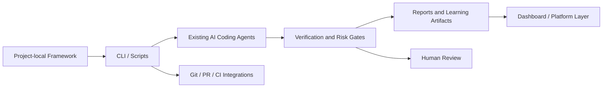

**การนำทาง:** ดู [ภาพรวม](PRODUCT_VISION.md)

# Productization และ Platform

เอกสารนี้อธิบายการขยายจาก framework-first solo workflow ไปสู่ CLI, Git/PR workflows, dashboard, integrations, audit, secret protection, independent review, team mode และ roadmap

---

## Git and Pull Request Workflow

ในเวอร์ชันที่ mature ระบบควรรองรับ Git/PR workflow:

- สร้าง branch หรือ worktree ก่อน AI edits
- commit หรือ checkpoint changes แยกตาม task
- สร้าง diff preview พร้อม risk summary
- แนบ Trust/Risk Report และ Engineering Reflection Report กับ PR
- flag files หรือ changes ที่ต้อง human review
- block merge สำหรับ critical/high unresolved findings ตาม policy
- เก็บ decision log และ verification evidence เป็น artifacts

สำหรับ solo-first version อาจเริ่มจาก local diff และ branch/checkpoint ก่อน แล้วค่อยเพิ่ม PR automation

## CLI / TUI Layer

CLI เป็น interface แรกที่เหมาะกับ framework-first product เพราะทำงานใน repo เดิมได้และ integrate กับ agents/scripts ง่าย

ตัวอย่าง commands:

```text
vgai init
vgai analyze
vgai plan
vgai verify
vgai repair
vgai report
vgai reflect
vgai doctor
```

### Workflow Command Responsibilities

- `vgai init` ติดตั้ง trust kernel, templates, scripts และ instruction files
- `vgai analyze` ตรวจ project stack, scripts, risks และ missing setup
- `vgai plan` สร้าง requirement analysis, acceptance criteria และ implementation plan
- `vgai verify` รัน verification gates และสร้าง trust/risk findings
- `vgai repair` ใช้ bounded repair policy เมื่อ checks fail
- `vgai report` สร้าง reports และ handoff packages
- `vgai reflect` สร้าง reflection questions และ skill updates
- `vgai doctor` ตรวจ framework installation และ configuration

## Optional Web App / Dashboard Layer

web app ไม่ใช่ core system ตั้งแต่แรก แต่เพิ่มภายหลังเป็น dashboard/interface layer ได้:

- ดู reports, findings และ trends
- ดู skill progression และ learning history
- configure policies, budgets และ integrations
- review PRs, diffs และ human-review handoffs
- ดู team/organization metrics ในอนาคต

## Integration Layer / Tool Connector Layer

integration ที่เป็นไปได้:

- Git providers เช่น GitHub/GitLab
- CI providers
- package/build tools
- issue trackers
- secrets scanners
- MCP tools หรือ tool servers
- AI coding agents และ IDE integrations

integration ควรเก็บ evidence และ audit trail ไม่ใช่เพียง trigger AI calls

## Audit Trail and AI Governance

ระบบควรบันทึก:

- prompts หรือ structured requests สำคัญ
- model/role ที่สร้าง decisions
- assumptions และ confidence
- rule triggers และ evidence
- approvals และ human review flags
- checks ที่รันและผลลัพธ์
- repair iterations และ stop decisions
- diff/rollback metadata

audit trail ช่วย accountability และช่วย evaluate research/product quality

## Secret Detection and Sensitive Data Protection

ก่อนส่ง context ให้ AI หรือสร้าง reports ระบบควรตรวจ secrets และ sensitive data:

- environment variables และ keys
- tokens/passwords
- patient/customer data
- production credentials
- private config

เมื่อพบ sensitive data ระบบควร redact, warn, block หรือ require approval ตาม policy และไม่ควร claim safe handling โดยไม่มี evidence

## Independent AI Review / Backstop Reviewer

สำหรับ changes ที่ risk สูง ระบบอาจใช้ independent AI reviewer เป็น backstop:

- reviewer ไม่ควรใช้ context เดียวกับ builder ทั้งหมดโดยไม่จำเป็น
- reviewer ควรตรวจ diff, acceptance criteria, risks และ evidence
- finding ของ reviewer ต้องถูกแยกจาก claim ของ builder
- high-risk unresolved findings ควร trigger human review

AI reviewer เป็นตัวช่วย ไม่ใช่ replacement ของมนุษย์สำหรับเรื่อง production/security-critical

## Quality and Impact Dashboard

dashboard อาจแสดง:

- pass/fail trends ของ build/typecheck/lint/test
- risk distribution ของ tasks
- repair success/failure rate
- stop-condition decisions
- unresolved findings
- human review handoff count
- learning topics และ skill coverage
- token/cost metrics
- regression หรือ rollback frequency

## Optional Team and Organization Mode

หลัง solo-first core พิสูจน์แล้ว ระบบอาจรองรับทีม:

- shared policies และ rule registries
- organization-level risk thresholds
- reviewer assignment
- audit/compliance reports
- team learning dashboards
- integration กับ PR/CI workflows

team mode ควรเพิ่มภายหลัง ไม่ควรทำให้ solo developer onboarding หนักเกินตั้งแต่ต้น

## Product Roadmap

### Phase 1: Framework-First Solo Prototype

- project-local `.vgai` files
- `AGENTS.md` / `CLAUDE.md`
- basic workflows, templates และ scripts
- Trust/Risk Report และ Reflection Report
- manual diff/check workflow

### Phase 2: Strong Solo Framework Product

- CLI commands
- stack detection
- rule registry
- guided verification gates
- build-and-repair policies
- stop conditions
- skill progression

### Phase 3: Agent Integration Product Beta

- deeper Claude/Codex compatibility
- MCP/tool server integration
- automated report generation
- independent AI review
- Git branch/PR support

### Phase 4: Platform Expansion

- web dashboard
- team/organization policies
- audit trails
- integrations
- quality/learning analytics

## Product Vision Diagram



