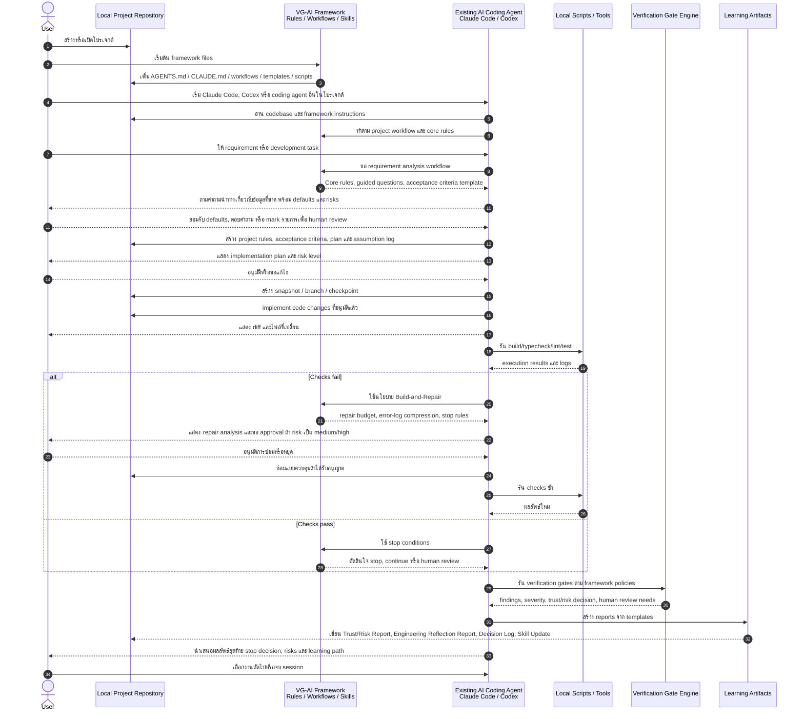

**การนำทาง:** ดู [ภาพรวม](PRODUCT_VISION.md)

# การเปรียบเทียบกับ Chief และโหมดความเข้ากันได้

**Chief compatibility mode** เป็นวิธีที่รองรับสำหรับรัน framework โดยใช้คำสั่งภายในโปรเจกต์ (`AGENTS.md`, `CLAUDE.md`, workflows, skills) เพื่อ guide coding agent ที่มีอยู่แล้ว ส่วน **Full product mode** เพิ่มการตั้งค่าที่ AI จัดการ การกำกับหลายบทบาท และ orchestration ที่ลึกขึ้น ดู [02](02_AI_MANAGED_WORKFLOW.md) และ [03](03_AI_ORCHESTRATION_AND_MULTI_ROLE_GOVERNANCE.md)

---

## ความสัมพันธ์กับ Chief

Chief เป็น framework เวิร์กโฟลว์แบบมีโครงสร้างสำหรับ AI coding agents เหมาะกับวิศวกรที่รู้วิธี supervise AI agents อย่างมีประสิทธิภาพอยู่แล้ว

โปรเจกต์นี้ได้รับแรงบันดาลใจจากแนวคิดเวิร์กโฟลว์แบบมีโครงสร้าง แต่เน้นผู้พัฒนาที่มีประสบการณ์น้อยกว่าและยังไม่มีวิจารณญาณระดับ senior เพียงพอ ดังนั้นระบบจึงเพิ่ม verification gates, guided verification questions, trust reports, risk detection, checklist-based review, Build-and-Repair Loops, Stop Conditions, Engineering Reflection Reports, Skill Progression, Mentor Mode และ human review handoff materials เพื่อช่วยผู้ใช้ตัดสินว่า output ที่ AI สร้างควรเชื่อถือ แก้ไข หยุด หรือส่งให้มนุษย์รีวิว

กล่าวสั้น ๆ:

> Chief ช่วยวิศวกรที่มีประสบการณ์ควบคุม AI agents ส่วนโปรเจกต์นี้ช่วยผู้พัฒนาที่มีประสบการณ์น้อยใช้ AI coding agents ผ่านการตรวจสอบ การตัดสินใจแบบมีคำแนะนำ และการสนับสนุนการเรียนรู้

framework สามารถทำงานในลักษณะคล้าย Chief ได้ โดยใช้ไฟล์อย่าง `AGENTS.md`, `CLAUDE.md`, workflow documents, skill files, report templates และ scripts เพื่อให้เครื่องมืออย่าง Claude Code หรือ Codex ทำตาม framework ได้โดยไม่ต้องสร้าง AI coding agent ใหม่หรือเว็บแอปเต็มรูปแบบ

ความแตกต่างหลักคือกลุ่มผู้ใช้เป้าหมายและชั้น learning/verification ที่เพิ่มเข้ามา:

- Chief-style workflow: โครงสร้างและการควบคุมสำหรับผู้ใช้ AI-agent ที่มีประสบการณ์
- framework นี้: โครงสร้าง การตรวจสอบ การตัดสินใจหยุด risk reporting และการสนับสนุนการเรียนรู้เชิงวิศวกรรมสำหรับผู้พัฒนาที่มีประสบการณ์น้อย

## Chief Compatibility Mode: Sequence Diagram การใช้งาน Framework

